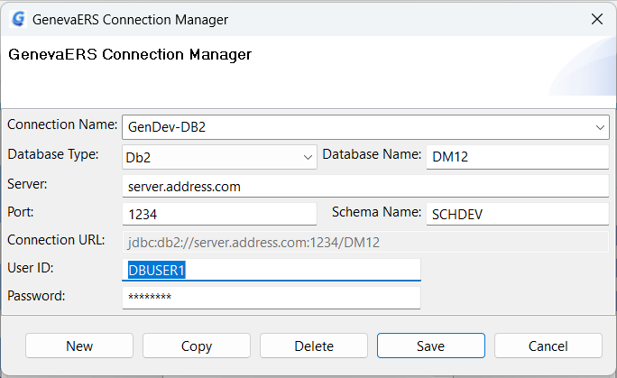
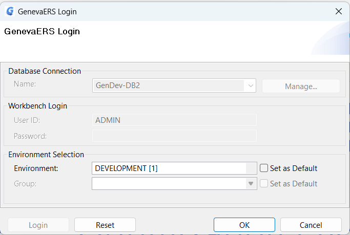
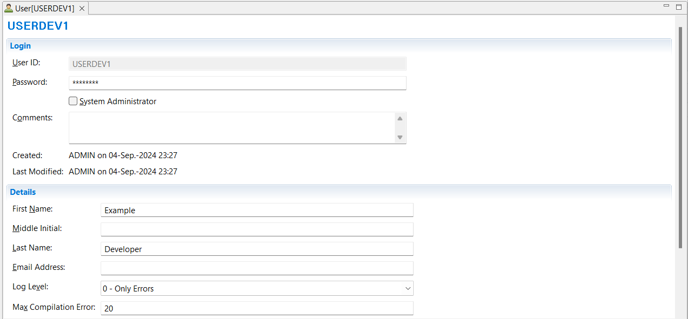
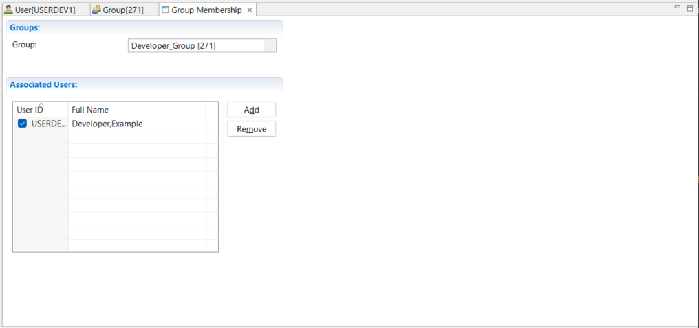
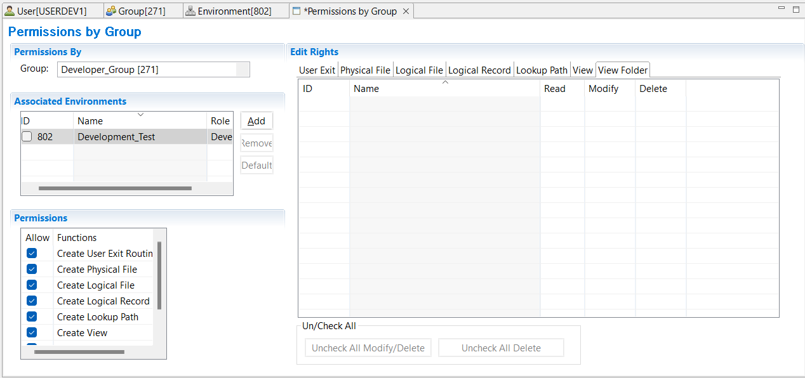

{: .no_toc}
# Workbench Administrator Tasks  

TABLE OF CONTENTS 
1. TOC
{:toc}  

## Introduction

The GenevaERS Workbench is supplied with the user ID of **ADMIN** for Db2 connections. This userid has system administration rights, which means it has the authority to create and edit users, groups and environments, as well as rights to create and edit all the GenevaERS metatdata components associated with views.

Note: PostgresQL connections can be administered in the same way, but using the admin userid and password set up during PostgresQL installation.  

The following guided examples build on each other.

## Example 1: Login with user ID ADMIN and update the password.

1. Start the GenevaERS Workbench.
2. If this is your first login to the GenevaERS Workbench, the **GenevaERS Connection Manager** Screen will appear. Otherwise click **Manage**.
3. In the **Connection Name** field type **GenDev-Db2**
4. From the **Database Type** list, select **Db2** 
5. In the **Database Name** field type the name of the Db2 database.
5. In the **Server** field type the IP address or domain name of the database host system.
6. In the **Port** field type the port number identifying the database.
7. In the **Schema Name** field type the name of the database schema.
8. In the **User ID** field type the User Id required to access the database. On mainframe systems, this is normally a RACF User Id.
9. In the **Password** field type the password for the User Id above.
10. Click **Save**  

The GenevaERS login screen will appear.

1. In **Database Connection** > **Name** the name **GenDev-Db2** will be displayed.
2. In **Workbench Login** > **User ID** type **ADMIN**. 
3. Leave **Workbench Login** > **Password** as blank. (Initially there is no password for ADMIN.)
4. Click **Login**  
Now you have logged on to the database you can select the GenevaERS environment.
1. From **Environment Selection** > **Environment** select **Development[1]**. This is the default environment created at Workbench installation. 
Note: There is no option to select a Group at this point, because ADMIN is a system administrator user ID.
1. Click **OK**.

You are now logged on to the GenevaERS Workbench. Update the password for **ADMIN**:  
1. In the Navigator pane, click **Administration** > **Users**  
A list of Users will appear in the Metadata List area. 
2. Double-click on User **ADMIN**  
The User definition will open in the Editor Area.
3. Update the **Password** field.
4. Save the User definition **File** > **Save**

## Example 2: Login as ADMIN and create a new general User ID.

1. Start the GenevaERS Workbench.
2. In **Database Connection** > **Name** select **GenDev-Db2**.
3. In **Workbench Login** > **User ID** type **ADMIN**. 
4. In **Workbench Login** > **Password** type the password (or leave blank if you have not set a password).  
5. Click **Login**  
Now you have logged on to the database you can select the GenevaERS environment.
6. From **Environment Selection** > **Environment** select **Development[1]**. This is the default environment created at Workbench installation. 
Note: There is no option to select a Group at this point, because ADMIN is a system administrator user ID.
7. Click **OK**.

You are now logged on to the GenevaERS Workbench. Create a new User ID: 

1. Select **Administration** > **New** > **User** 
2. In the **Name** field type **USERDEV1**. This user is going to be assigned to a developer group.
3. In the **Password** field type **PASSDEV1** as an initial password.
4. We are specifying a general user, so the System Administrator checkbox is not selected.
5. In the **First Name** field type **Example**.
6. In the **Last Name** field type **Developer**.
7. Save the user definition **File** > **Save**.

A new **general user** must be added as a member of at least one **group** before it can be used. This is shown in the next example. 
Note that a **system administrator** does not need to be a member of a group.

## Example 3: Login as ADMIN, create a new Group and assign a User to that Group.

Login as **ADMIN**. See [Example 2](#example-2-login-as-admin-and-create-a-new-general-user-id) above.  

1. Select **Administration** > **New** > **Group**. 
2. In the **Name** field type **Developer_Group**.
3. Save the group definition **File** > **Save**.

You can now assign the user to this group. You can view and add users to groups by selecting a group and viewing and editing the associated users list, or, you can view the user and edit the associated Groups list. Here we will add the user to the group.

1. Select **Administration** > **Group Security** > **Membership by Group...** 
2. In the **Group** field, select **Developer_Group** from the drop down box.
3. Click in the **Associated Users** table, then click **Add**.
5. Select the checkbox by the User ID **USERDEV1**, then click **OK**.
7. Save the group membership definition **File** > **Save**.
   

## Example 4: Login as ADMIN and create a environment.

Login as **ADMIN**. See [Example 2](#example-2-login-as-admin-and-create-a-new-general-user-id) above.  

1. Select **Administration** > **New** > **Environment**. 
2. In the **Name** field type **Development_Test**.
3. Save the group definition **File** > **Save**.

## Example 5: Login as ADMIN and assign an environment to a group with a role.

Login as **ADMIN**. See [Example 2](#example-2-login-as-admin-and-create-a-new-general-user-id) above.  

1. Select **Administration** > **Group Security** > **Permissions by Group...**
2. In the **Group** field, select a **Developer_Group** from the drop down box. You can sort the list by clicking on **ID** or **Name** in the header of the list.
3. Click in the **Associated Environments** table, then click **Add**.
4. In the window "Select components to be associated" select the checkbox by the environment **Development_Test**, then click **OK**.
5. Assign a **Role** that members of this group will have in this environment. Select **Developer** from the drop down list in the **Role** column..
8. Save the default permissions for the developer role **File** > **Save**.

For more information on Workbench security see [Workbench Security Overview](../SecurityOverview.md) and [Create Users, Groups and Permissions](../MetaData/CreateUsersGroupsPerm.md).
