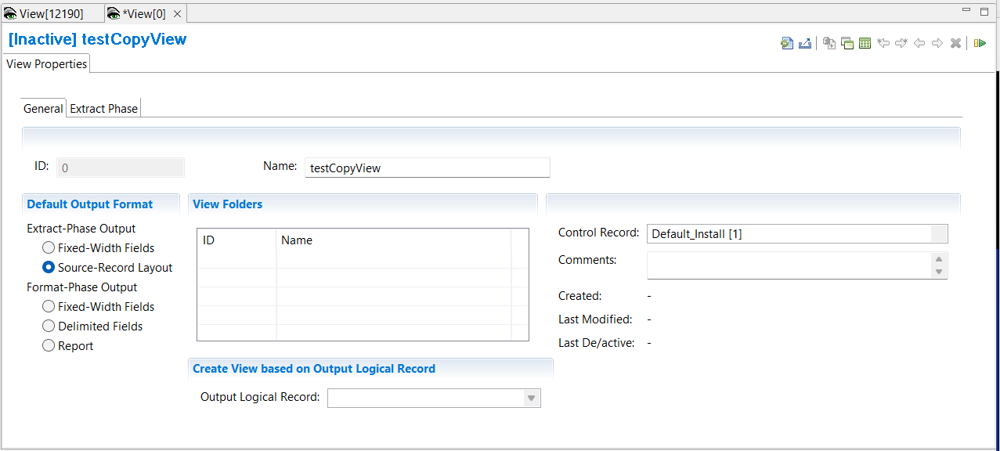

{: .no_toc}
# Create Extract-only view with source-record layout

TABLE OF CONTENTS 
1. TOC
{:toc}  

Another type of Extract only view is a copy view. This view has no columns as the output layout is the same as the source record layout. The view can still define record filters and output record logic.

### Define view

To define a copy view:

1. Select **Administration** > **New** > **View** from the menu.  



The first screen presented is the View Properties screen, which contains the sub-tab **General**.

1. In the **Name** field  type a descriptive name.
2. In the **Control Record** field select the control record.
3. Select the **Default Output Format** required. This will affect the other sub-tabs available to you. For this case, an Extract only copy view, select **Extract-Phase Output** > **Source-Record Layout**.

Note that 'Create View based on Output Logical Record' is not selectable in this case.

4. Select the **View Properties** sub-tab **Extract Phase**. Here you have the option to limit the number of output records written with the **Extract-Phase Output Limit**
5. Save the view **File** > **Save**  

When you save a new view, the view ID is assigned by the Workbench and is not editable.

<!-- View Source specification description -->
  

<!-- Output destinations description -->
  

### Define a filter

The view can contain logic to filter input records at extract-phase time.  See [overview of record filters](../OverviewRecordFilters.md) and [create record filters](./CreateRecordFilters.md).

<!-- Activate view description -->
  
