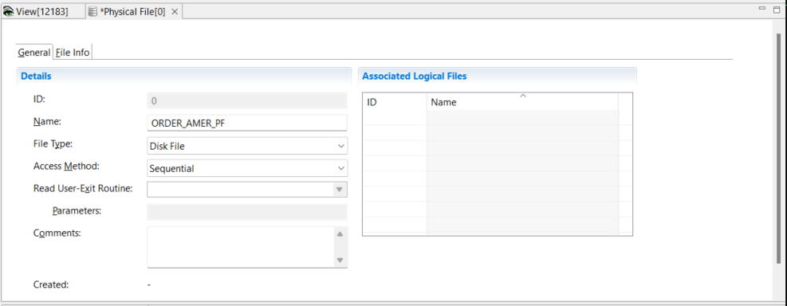
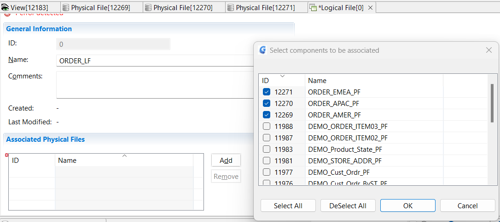

{: .no_toc}

# Create LRs, LFs and PFs

TABLE OF CONTENTS 
1. TOC
{:toc}  

## Physical file

To create a physical file definition

1. Select **Administration** > **New** > **Physical File**  

2. In the **Name** field type a descriptive name.  
All GenevaERS components must be uniquely named within an environment. The names may be up to 48 characters long, starting with a letter, and composed of letters, numbers, and the underscore (_).  
  
It is a good practice to add an underscore and the letters “PF” at the end of the name. This is not required, but it helps differentiate physical files from similarly named logical files and logical records. Typical names would be “CUSTOMER_PF,” “ORDER001_PF,” “ORDER002_PF,” and “US_SALES_PF.”

3. Select the **File Type** from the drop down list.  
Most GenevaERS processes use disk files. Select Tape File only when GenevaERS high-speed tape processing is required. Pipes and tokens are special internal GenevaERS virtual files that are never written to disk or tape. Find out more about them [here].  

4. For File Type **Disk File** you can select the **Access Method** from the drop down list.  
Again, typical GenevaERS processes use sequential access.  
  
5. For File Type **Read User-Exit** you can select a previously defined **Read User-Exit Routine** and **Parameters** to pass to the routine.  
Read user-exits are custom-developed programs called by the Extract Engine to read data from files for input to GenevaERS, rather than the engine reading the files directly. Parameters may be passed to the exits when they are called. Find out more about them [here].

Physical File information is displayed across two tabs, **General** and **File Info**. The **File Info** tab changes to **Database Info** when the **File Type** **Database** is selected.  

For **File Type** of **Disk File** define the data set DD name on the **File Info** tab.  
The **Input** **DD Name** field should match the DD Name of the source data set in the JCL for the Extract phase step of the Performance Engine.
The **Data Set Name** is optional. If the fully qualified data set name is provided and the input DD name is not found in the JCL, the Extract Engine attempts to dynamically allocate this file. The disposition defaults to Share.

The **Output** **DD Name** field enables you to specify the DD name that will receive output from a View. 

6. Save the physical file definition **File** > **Save**,  

When the physical file is saved, it is assigned a unique GenevaERS ID. The time stamps show when the file was created, and when it was last updated. 
Physical files are contained within one or more logical files. A list of the associated logical files is presented on this screen for reference. The association of a physical file with a logical file can be done on the Logical File screen, which is show below.

## Logical Files

To create a logical file definition

1. Select **Administration** > **New** > **Logical File**  
2. In the **Name** field type a descriptive name.  
A logical file definition must have a unique name. The name may be up to 48 characters long, starting with a letter, and composed of letters, numbers, and the underscore (_). It is a good practice to add an underscore and the letters “LF” at the end of the name. This is not required, but it helps differentiate logical files from similarly named physical files and logical records. Typical names are “CUSTOMER_LF,” “ORDER_LF,” and “SALES_LF.”

You can use the Comments field to describe this logical file and its purpose.

### Physical File Association

Logical files are associated with one or more physical files. To make the association
3. Click **Add** and select one or more physical files to be associated. After you click OK, the physical file is displayed in the Associated Physical Files area.  

4. Save the logical file definition **File** > **Save**  

After you save the logical file for the first time, an ID is assigned and the time stamps are updated. If you return to the physical file definition, you can see that the association is also shown there under **Associated Logical Files** 

The records in logical files can be described by many logical records. A list of the associated logic records is presented on this screen for reference. You can associate a logical file with an LR on the Logical Record screen. You must first define an LR before you make the association.

## Logical Records

Logical Records can be used by many different Views. To view existing logical records, click **Logical Records** in the Navigator pane and open a logical record in the metadata list at the bottom of the screen.

To create a new Logical Record

1. Select **Administration** > **New** > **Logical Record** from the menu.
2. In the **Name** field type a descriptive name. 
The name may be up to 48 characters long, starting with a letter, and composed of letters, numbers, and the underscore (_).  
3. The **Lookup User-Exit Routine** and **Parameters** are used for custom-developed routines that are called instead of doing a lookup. User Exits are described [here].

Logical record information is displayed across three tabs, **LR Properties**, **LR Fields** and **Associated Logical Files**.  

### LR Fields

Select the **LR Fields** tab.  
The grid on this panel is used to create and maintain field definitions. Fields are defined with names, data types, start positions and lengths, and numbers of decimal points. All the data types available are discussed in [Data Types](../../AdvancedFeatures/MetaData/DataTypes.md) in Advanced Features.

1. To define a field **Edit** > **Insert Field Before**  
   or click the Insert Field icons on the Logical Record Editor toolbar  
   or press Alt+Insert  

This enables you to fill in values to complete the field definition. As with LR names, a **Field Name** may be up to 48 characters long, starting with a letter, and composed of letters, numbers, and the underscore (_).  

When you save the logical record, the system automatically assigns a field ID to each field definition.

### Defining Key fields

For a logical record to be the target of a join, you must define the structure of the primary key. The primary key can be composed of one or more fields. Click in the **Primary Key** cell for the first field in the key, and select 1. Select 2 for the second field in the primary key, and continue in this way until all key fields are defined. The total length of all key fields in the LR is shown in the Total Key Length field.

### Redefines

As fields are added, the start position of the new field begins at the end position of the last added field. However, you can override this and set field positions to overlap. The redefined fields will be shown in the **Redefines** cell.

Use the number in the Total Length field to ensure that the length of the LR is correct when adding redefined fields.

### Other Fields

Scrolling right on the grid reveals additional field attributes that can be assigned.  
The **Date/Time Format** field designates how the date is stored in fields, if applicable.  
A check mark in the **Signed** check box indicates that the field contains valid sign data.  
If this field is used as a column in a view, the **Heading 1**, **Heading 2** and **Heading 3** fields can be used as to set the headings for the column in that view.

### Logical File Association

Select the **Associated Logical Files** tab. On this tab, you define which logical files contain records in the layout of the LR. 
  
1. Click **Add** and select one or more logical files to be associated. After you click OK, the logical file is displayed in the Associated Logical Files tab.  

2. Save the logical record definition **File** > **Save**.

After you save the logical record for the first time, an ID is assigned and the time stamps are updated. If you return to the logical file definition, you can see that the association is also shown there under **Associated Logical Records** 
