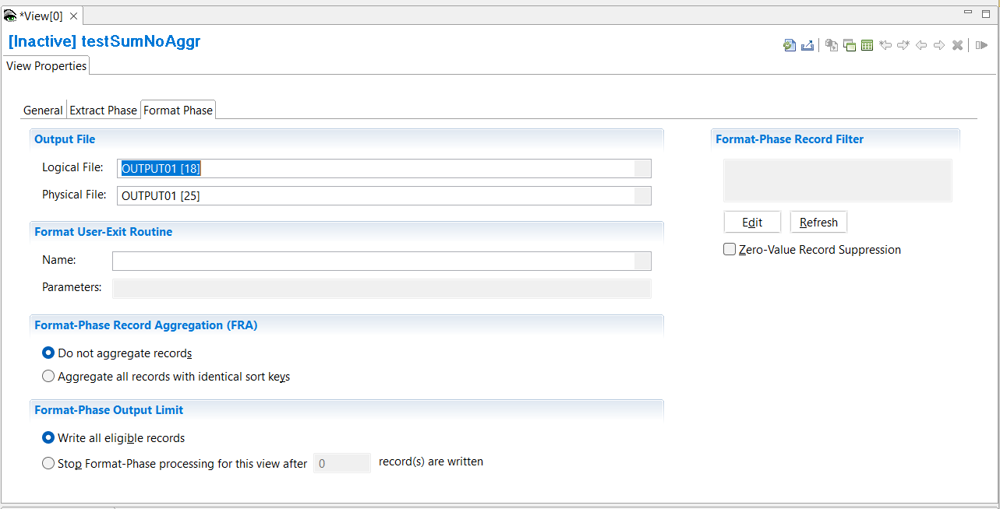

{: .no_toc}
# Create Summary Views

TABLE OF CONTENTS 
1. TOC
{:toc}  

A view is a GenevaERS metadata component that defines a data transformation. See [Overview of views](../OverviewViews.md) and [overview of summary views](../OverviewFormatViews.md) for a detailed description.

In the workbench views can be grouped together in **View Folders**. To list existing views:  

- Click **View Folders** > **ALL_VIEWS** or,
- Click **View Folders** > *folder-name* in the Navigator pane.

The views are shown in the metadata list at the bottom of the workbench screen. All views described in this section are summary views that require an extract phase and a format phase to be defined and exectuted.

## Create a summary view - Fixed-Width Field output, no aggregation

To create a new summary view with no aggregation:

1. Select **Administration** > **New** > **View** from the menu.  



The first screen presented is the View Properties screen, which contains the sub-tab **General**.

1. In the **Name** field  type a descriptive name.
2. In the **Control Record** field select the control record.
3. Select the **Default Output Format** required. This will affect the other sub-tabs available to you. For this case, a summary view with column defined output, select **Format-Phase Output** > **Fixed-Width Fields**.
4. You can select an output LR to pre-define columns by using **Create View based on Output Logical Record**.  This option is only available before the first save. It could be useful if the output of this view is to become the source of another view via a pipe or a token.

5. Select the **View Properties** sub-tab **Extract Phase**.  
Here you have the option to limit the number of output records written with the **Extract-Phase Output Limit**.  

6. Select the **View Properties** sub-tab **Format Phase**.  
Here you have the following options:
   - define a specific output destination for the format phase under **Output File**. See [output destinations](#output-destinations) below.
   - define a **Format User-Exit Routine**. See [user exits](./overviewUserExits.md).
   - specify aggregation option. Select **Do not aggregate records** as this view type does not have record aggregation.
   - limit the the number of records written during the format phase.
   - define a filter to select or skip format phase output records. See [defining a filter](#defining-a-filter).
   - specify Zero-Value Record Suppression. See [zero-value record suppression](#zero-value-record-suppression)
7. Save the view **File** > **Save**  

When you save a new view, the view ID is assigned by the Workbench and is not editable.

### View Source 

Next specify the view source. You must have already defined the physical files, logical files and logical records definitions for the source you want to specify. Note that this is the same process for Extract-phase only views and summary views.

For information on how to define your own logical record, logical file and physical file definitions look at [Create LR, LF, and PF metatdata](../../AdvancedFeatures/MetaData/CreateLRLFPFs.md) in Advanced Features.

1. Toggle to the **View Editor** screen.
2. Select **Edit** > **Add View Source**  
   Alternatively, you can Right Click on **View Sources** then select **Add View Source**
3. In the pop-up window use the drop down arrow to select the **Logical Record**, and the **Logical File** you require. Click **OK**.

### Adding columns

Next define the output layout by adding columns to the view. The columns contain the characteristics of the output such as data type, the length, and the alignment, such as left, right, or center. They can also contain logic and lookup fields.

1. Select **Edit** > **Insert Column After**  
or you can insert a new column using the View Editor toolbar in the top right of the Editor Area. The arrow icons are used to insert new columns, or to move columns.  
A new column is added to the grid.
2.  Click the green cell at the bottom of the new column.  
The Column Source Properties frame opens on the right.  
3.  From the **Column Source Type** list, you can select 
**Column Logic**, 
**Constant**, 
**Lookup Field** or 
**Source File Field**. 
For more information on the column types see [Column Assignment](../ColumnLogic.md), [Data Types](./DataTypes.md), [Lookup Paths](../OverviewLookupPaths.md), and [Extract-Phase Column Logic](../../Reference/Workbench/LogicTextECLStatements.md).

You can add as many columns as you want, but be aware of the output record length. Each column displays the start and end position in the output record.  

Summary views require at least one sort key, and can have up to 5 sort keys defined. The sort keys must be defined columns.
1. To define a column as a **Sort Key**, first select the column by clicking the column. 
2. Select **Edit** > **Make Sort Key**
3. The **Sort Keys** cell for the column will be highlighted in yellow. Click the yellow cell and the **Sort Key Properties** frame will open on the right.
4. The **Sort Sequence** can be changed from the default Ascending to Descending here.
5. Save the view **File** > **Save**   

### Output destinations

Summary views have two phases. The extract phase writes to an extract file **EXTRnnn** where **nnn** is the **File Number**.  
This is defined on the **View Properties** screen > **Extract Phase** sub-tab > **File Number**.  
The default File Number is 0, so the default file name is EXTR000. If you are planning to create many summary views to run in the same pass, you may require the extract phase to write to different extract work files.  If you change the File Number you will see that the WRITE statement changes in the Extract-Phase Record Logic **View Source Properites** > **Record Logic**.

The default output destination for the format phase is the DD **F*****nnnnnnn*** where ***nnnnnnn*** is the view ID. For example, if the view ID is **12188** the default output file for the view is **F0012188**.

You can specify your own format phase output destination.

1. Select the **View Properties** sub-tab **Format Phase**. 
2. From **Output File** > **Logical File** list select the LF you want to write to.
3. From **Output File** > **Physical File** list select the PF you want to write to.
4. Save the view **File** > **Save**

### Defining a filter

The view can contain logic to filter input records at extract-phase time, and also filter output records at format-phase time.  See [overview of record filters](../OverviewRecordFilters.md) and [create record filters](./CreateRecordFilters.md).

### Zero-Value Record Suppression

To avoid output of records with zero in all numeric fields, select the  Zero-Value Record suppression option.

1. Select the **View Properties** sub-tab **Format Phase**. 
2. Tick the **Zero-Value Record Suppression** box.
3. Save the view **File** > **Save**

## Create a summary view - Fixed-Width Field output, with aggregation

To define a summary view with aggregation:

1. Select **Administration** > **New** > **View** from the menu.  



The first screen presented is the View Properties screen, which contains the sub-tab **General**.

1. In the **Name** field  type a descriptive name.
2. In the **Control Record** field select the control record.
3. Select the **Default Output Format** required. This will affect the other sub-tabs available to you. For this case, a summary view with column defined output, select **Format-Phase Output** > **Fixed-Width Fields**.
4. You can select an output LR to pre-define columns by using **Create View based on Output Logical Record**.  This option is only available before the first save. It could be useful if the output of this view is to become the source of another view via a pipe or a token.
5. Select the **View Properties** sub-tab **Extract Phase**. Here you have the option to limit the number of output records written with the **Extract-Phase Output Limit**
6. Select the **View Properties** sub-tab **Format Phase**, and click **Format-Phase Record Aggregation (FRA)** > **Aggregate all records with identical sort keys**.
For details of other options available on the **Format Phase** sub-tab, 

Here you have the following options:
   - to define a specific output file under **Output File**. See [output destinations](#output-destinations) below.
   - to define a **Format User-Exit Routine**. See [user exits](./overviewUserExits.md).
   - to specify aggregation, discussed later.
   - to limit the the number of records written during the format phase.
   - to define a filter to select or skip format phase output records. See [defining a filter](#defining-a-filter).
   - Zero-Value Record Suppression ??? . See [zero-value record suppression](#zero-value-record-suppression-)   ???
1. Save the view **File** > **Save**  

## Create a summary view - Delimited Field output

## Create a summary view - Report

### Activating the View 

To activate the view, use any of these methods: 
- Select  **Action** > **Activate** 
- Press the Activate icon on the View Editor toolbar 
- Press **F5**

Activation invokes the compiler which checks for errors and warnings.

When the view is active, save it to preserve this active state. The view is now ready to be run.

## Create a view - Extract only copy view

Another type of Extract only view is a copy view. This view has no columns as the output layout is the same as the source record layout. The view can still define record filters and output record logic.

To define a copy view:

1. Select **Administration** > **New** > **View** from the menu.  
View information is displayed on two separate screens:

- The View Properties screen, where you can modify information that applies to the whole view.  
- The View Editor screen, where you can define specific data transformations.

To toggle between the View Properties screen and the View Editor screen,  
- press **F9**,  
- or click the **Show Grid / Properties** button in the Editor area toolbar.

The first screen presented is the View Properties screen, which contains the sub-tab **General**.

1. In the **Name** field  type a descriptive name.
2. In the **Control Record** field select the control record.
3. Select the **Default Output Format** required. This will affect the other sub-tabs available to you. For this case, an Extract only copy view, select **Extract-Phase Output** > **Source-Record Layout**.
5. Select the **View Properties** sub-tab **Extract Phase**. Here you have the option to limit the number of output records written with the **Extract-Phase Output Limit**
6. Save the view **File** > **Save**  

Next define the [view source](#view-source), as in the previous case. A copy view has no columns.

You can optionally define [output destinations](#output-destinations), and a [record filter](#defining-a-filter).

### Activating the View 

To activate the view, use any of these methods: 
- Select  **Action** > **Activate** 
- Press the Activate icon on the View Editor toolbar 
- Press **F5**

Activation invokes the compiler which checks for errors and warnings.

When the view is active, save it to preserve this active state. The view is now ready to be run.
