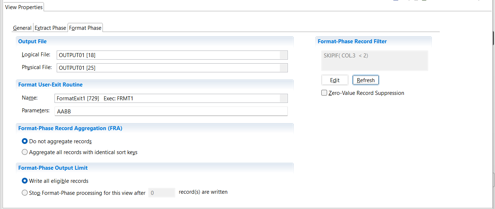

{: .no_toc}
# Create Summary View

TABLE OF CONTENTS 
1. TOC
{:toc}  

## Create a summary view - Delimited Field output

To create output that is delimited, the format phase is required. 
To define a view that will write delimited output:

### Add new view definition

1. Select **Administration** > **New** > **View** from the menu.  



The first screen presented is the View Properties screen, which contains the sub-tab **General**.

1. In the **Name** field  type a descriptive name.
2. In the **Control Record** field select the control record.
3. Select the **Default Output Format** required. This will affect the other sub-tabs available to you. For this case, a summary view with delimited output, select **Format-Phase Output** > **Delimited Fields**.
4. You can select an output LR to pre-define columns by using **Create View based on Output Logical Record**.  This option is only available before the first save. It could be useful if the output of this view is to become the source of another view via a pipe or a token.
5. Select the **View Properties** sub-tab **Delimited**.  
If a header row is required, tick **Include a header row**.  
To choose the character to delimit the fields, select from the **Field** drop down menu.  
To choose the character to enclose a string, select from the **String** drop down menu.
6. Save the view **File** > **Save**  
When you save a new view, the view ID is assigned by the Workbench and is not editable.

Other options on the Format Phase tab and the Extract Phase tab are described in sections below.

<!-- View Source specification description -->
 

<!-- COLUMN specification description -->
  

>>>> Add a note about the use of the headers in the header row 

<!-- Sort key specification description -->
  

<!-- Format-Phase column logic description -->
  

<!-- Output destinations description -->
  

<!-- Define filters links -->
  

### Specify aggregation

Views with delimited output can write all records, or can specify aggregation and collapse the output data based on sort keys. If the data is to be aggregated, 

- Select the **View Properties** sub-tab **Format Phase**, and click **Format-Phase Record Aggregation (FRA)** > **Aggregate all records with identical sort keys**.

If aggregation is selected you have the choice to select column aggregation functions.  
<!-- Notes here about record aggregation types SUM, etc -->
  

### Extract Phase tab options

Select the **View Properties** sub-tab **Extract Phase**.  

1) **Extract-Phase Record Aggregation (ERA)** Note: This option is only available if Format-Phase record Aggregation is selected.  
- Select **Do not aggregate records** for no aggregation of output records at extract-phase time.
- Select **Aggregate records with identical sort keys using a buffer of *n* records** to aggregate records with identical sort keys using a buffer with a limit of the *n* field. The *n* value is a positive integer up to 9 digits. The default for the *n* value is 4000.  

For a description of **ERA** see [Extract-Phase Record Aggregation Overview](../ExtractPhaseRecAgg.md).

2) You have the option to limit the number of output records written with the **Extract-Phase Output Limit**.  
- Select **Write all eligible records** to ensure that all eligible records are output. This button is selected by default.  
- Select **Stop Extract-Phase processing for this view after *n* records are written** to stop the processing of this view after *n* records are written. The *n* value is a positive integer up to 9 digits. The default for the *n* value is 100.

3) **File Number** is used to manage the intermediate extract file name. See [Output destinations](#Output-destinations) for more details. The default is 0.

### Additional Format Phase tab options

Select the **View Properties** sub-tab **Format Phase**.  

  

The **Output File** option is described in [Output destinations](#Output-destinations) above.

You have the option to specify a **User-Exit routine** to be called during the format phase:
- Select **Format User-Exit Routine** > **Name**  
Select a User-Exit Routine from the drop down list. All the routines
are of type Format. Sort the list by clicking on "id" or "name" in the header of the list. Reverse the sort order by clicking again on "id" or "name" in the header. 
- Select **Parameters** to specify input data for the user-exit routine. This can be up to 32 characters.

You have the option to limit the number of output records written with the **Format-Phase Output Limit**.
- Select **Write all eligible records** to ensure that all eligible records are output. This button is selected by default.  
- Select **Stop Format-Phase processing for this view after *n* records are written** to stop the processing of this view after *n* records are written. The *n* value is a positive integer up to 9 digits. The default for the *n* value is 100.

The **Format-Phase Record Filter** option is described in [Define filters](#Define-filters) above.

To avoid output of records with zero in all numeric fields, tick the **Zero-value Record Suppression** box.

<!-- Activate view description -->
  
