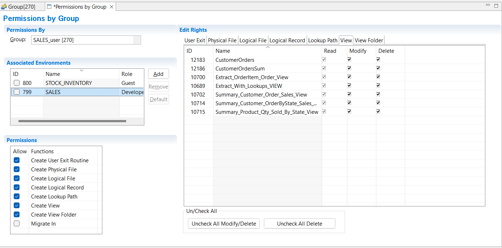
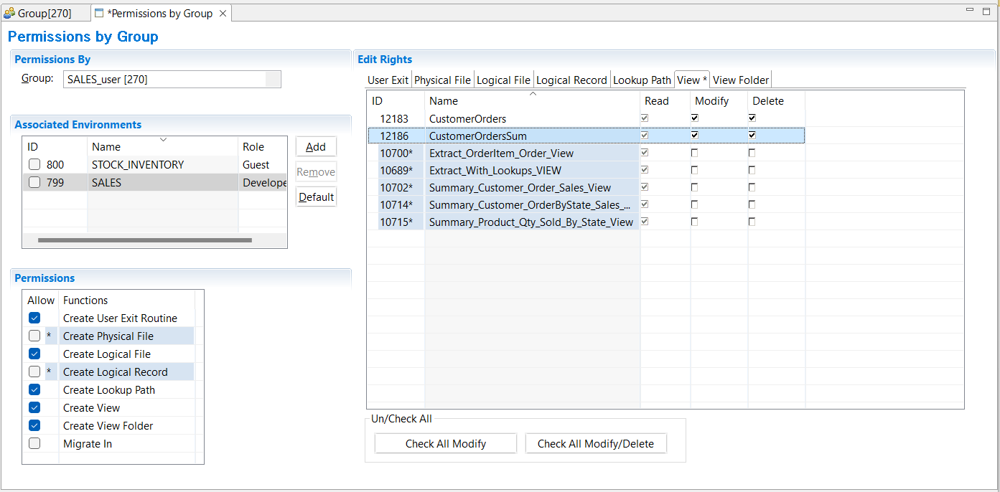

{: .no_toc}
# Users, Groups and Permissions

TABLE OF CONTENTS 
1. TOC
{:toc}  

## Add a Group

Only system administrators can create groups, so ensure you are logged into the workbench as a **system administrator**. You can be in any environment.

1. Select **Administration** > **New** > **Group** 
2. In the **Name** field type a descriptive name. Add **Comments** if desired.
3. Save the group definition **File** > **Save**.
  
When the Group is saved, it is assigned a unique GenevaERS ID. The time stamps show when the file was created, and when it was last updated. 

After the above is complete, the group is ready for immediate use.

## Add a User

Only system administrators can create users, so ensure you are logged into the workbench as a **system administrator**. You can be in any environment.

1. Select **Administration** > **New** > **User** 
2. In the **Name** field type a descriptive name. Add **Comments** if desired.
3. - To specify a system administrator, select the **System Administrator** checkbox.
   - To specify a general user, make sure to clear the System Administrator checkbox.
4. Save the user definition **File** > **Save**.
   
When the user is saved, it is assigned a unique GenevaERS ID. The time stamps show when the file was created, and when it was last updated. 

After the above is complete, a new **system administrator** user is ready for immediate use. 

A new **general user** must be added as a member of at least one **group**.

## Define Group Membership

Only system administrators can change group membership, so ensure you are logged into the workbench as a **system administrator**. You can be in any environment.

You can view and add users to groups by selecting a group and viewing and editing the associated users list, or, you can view the user and edit the associated Groups list.

### Membership by Group

1. Select **Administration** > **Group Security** > **Membership by Group...** 
2. In the **Group** field, select a group from the drop down box. You can sort the list by clicking on **ID** or **Name** in the header of the list.
3. To view the list of existing users in this group, click in the **Associated Users** table.
4. To add users to this group, click **Add**.
5. Select the checkbox(s) by the User ID(s) you want to add, then click **OK**.
6. To remove users, select the checkbox by the User ID in the Associated Users list, then click **Remove**.
7. Save the group membership definition **File** > **Save**.

### Membership by User

1. Select **Administration** > **Group Security** > **Membership by User...** 
2. In the **Users** field, select a user from the drop down box. You can sort the list by clicking on **ID** or **Name** in the header of the list.
3. To view the list of groups this user already is a member of, click in the **Associated Groups** table.
4. To add this user to a new group, click **Add**.
5. Select the checkbox(s) by the Group(s) you want to add, then click **OK**.
6. To remove a user from a group, select the checkbox by the Group ID in the Associated Groups list, then click **Remove**.
7. Save the user membership definition **File** > **Save**.

## Define Permissions

Only system administrators can modify permissions, so ensure you are logged into the workbench as a **system administrator**. You can be in any environment.

The following describes how to change the permissions for a combination of a group and an associated environment. The new permissions apply to all members of the group.

1. Select **Administration** > **Group Security** > **Permissions by Group...**
2. In the **Group** field, select a group from the drop down box. You can sort the list by clicking on **ID** or **Name** in the header of the list.
3. To view the list of environments already defined in this group, click in the **Associated Environments** table.
4. To add an environment to the list, click **Add** to display the window "Select components to be associated". 
5. Select the checkbox(s) by the environment ID(s) you want to add, then click **OK**.
6. To remove an environment from a group, select the checkbox by the environment ID in the Associated Environments list, then click **Remove**.
7. Assign a **Role** that members of this group will have in this environment. The choices are **Guest**, **Developer** and **Administrator**.
   Note: these roles have default Edit Rights and Permissions, but they can be overridden.
8. If you wish to use the default settings, save the permissions **File** > **Save**

### Override the default Permissions and Edit Rights

The following describes how to override the default permissions set above.

1. Select **Administration** > **Group Security** > **Permissions by Group...**
2. In the **Group** field, select a group from the drop down box.
3. Select the environment you wish to modify permissions for in the **Associated Environments** table.
4. You can modify **Edit rights** for each existing item of all metadata types. That is **Read**, **Modify** and **Delete** rights.
   1. Select the metadata type using the tabs in the **Edit Rights** table
   2. Check or uncheck the boxes in the list as required. Use the **Uncheck All ...** buttons as required.
6. You can modify the **Permissions** for this environment, that is the rights to **Create** different metadata types, and the right to **Migrate** data into this environment.
7. Save the permissions **File** > **Save**
8. Select another environment and repeat, if required.

If changes are made from the defaults, the changes are marked by **\***.

To revert to the default setting for the **Role**, click **Default** button.