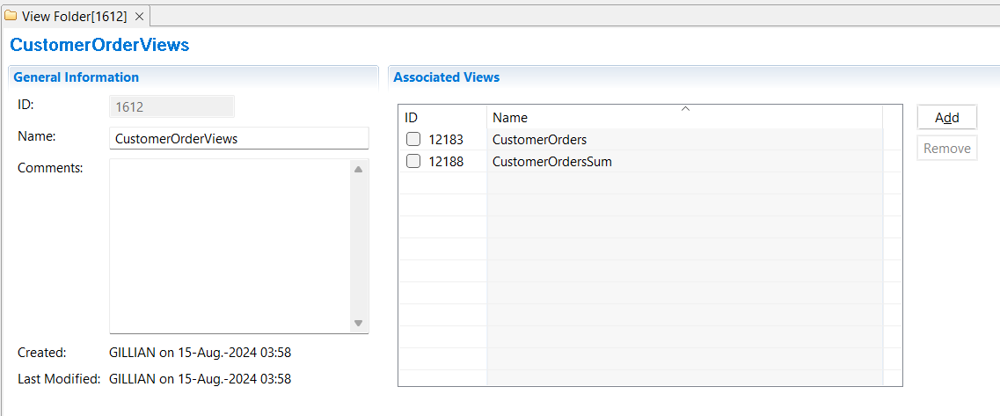

{: .no_toc}
# View Folders

In the workbench views can be grouped together in **View Folders**. View folders are often named for a particular developer or function. Security can be applied to view folders to prevent unauthorized access.  

Each environment has a default view folder of **ALL_VIEWS**. Views can be members of many view folders. Users can be assigned a default view folder. 

## Create a View Folder

System and environment administrators can always perform this task. General users can perform this task if the group selected during login has the Create View Folders right in that environment.  

To create a new view folder:

1. Select **Administration** > **New** > **View Folder** from the menu.  
2. In the **Name** field type a descriptive name.  
3. Save the view folder **File** > **Save**  

Next add views to the view folder:

1. Click the **Add** button under **Associated Views**.  
2. In the pop-up window, select the checkboxes of the view IDs you want to add to the view folder.
3. Click **OK**.
4. Save the view folder **File** > **Save**  

To remove views from the view folder:

1. Under **Associated Views**, select the checkboxes of the view IDs you want to remove from the view folder.
2. Click **Remove**.  
3. Save the view folder **File** > **Save**  

