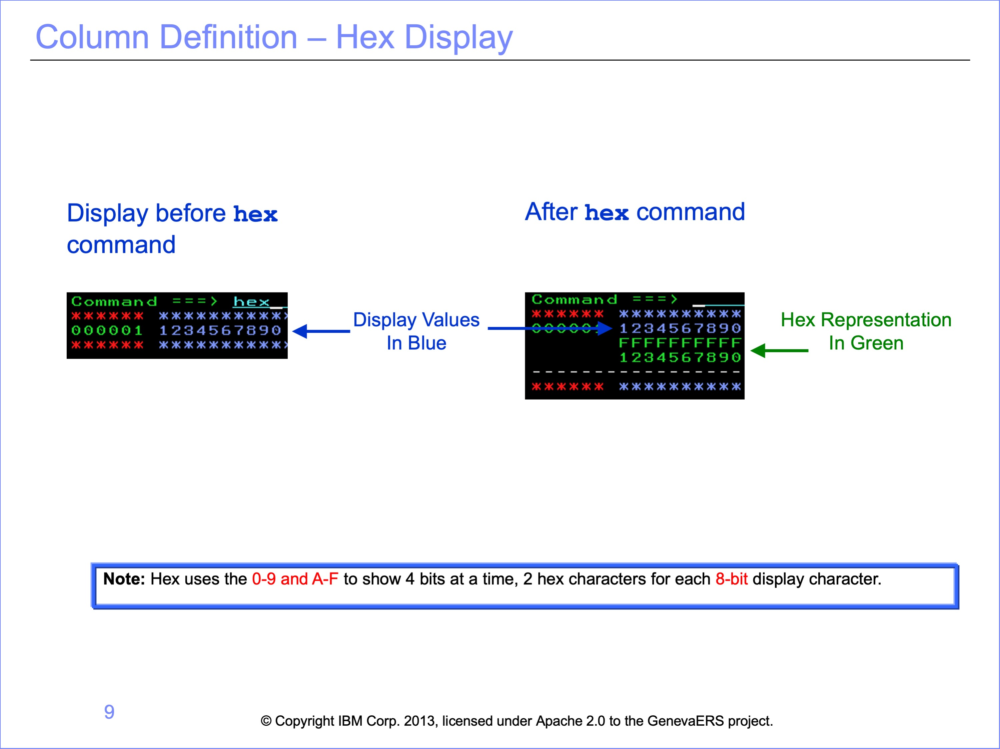
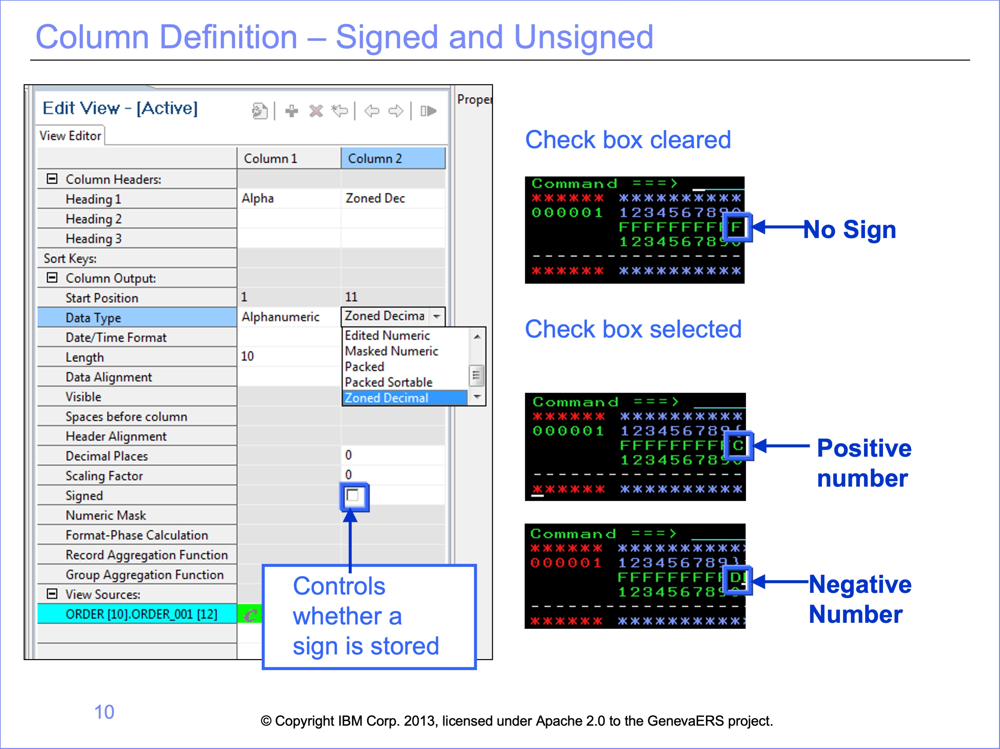
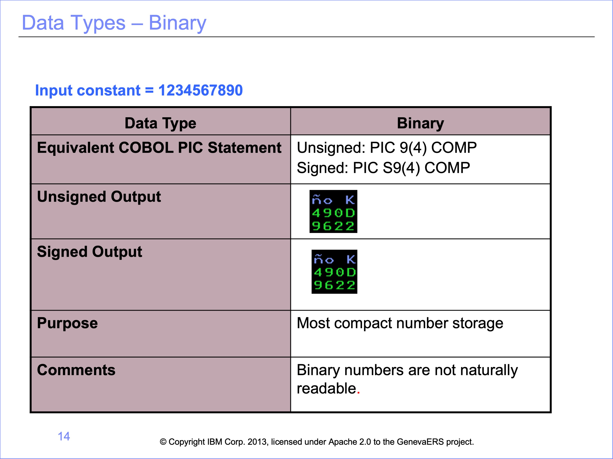
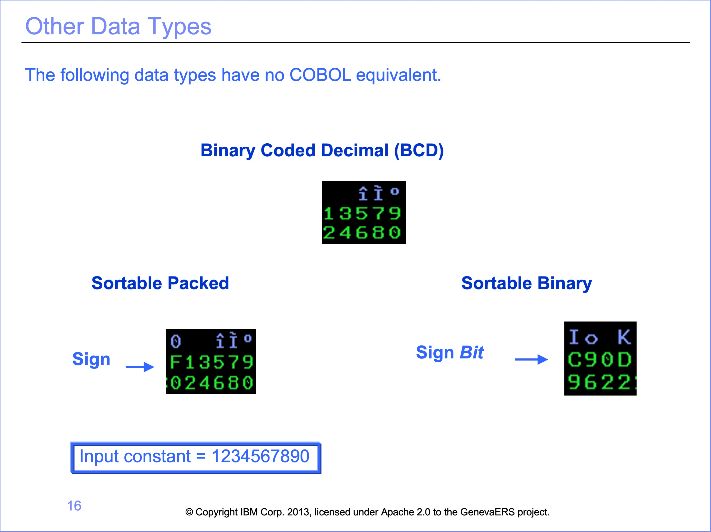

## Data Types 

The Performance Engine transforms data into numerous different types, many of which are not available as standard formats in COBOL or other languages. The data type chosen affects other column and logical record attributes, such as length, sign, decimal place, and mask, and thus is very important in building file output views. The following information will help you understand how values are stored.

### Hex Display

Hexadecimal display or “hex” for short, is used to highlight differences between each data type. The example here is the zoned decimal formatted number 1234567890. In most mainframe editors, hex can be displayed by using the command 'hex' or 'set hex' while viewing file contents. The first line shows the display value. Below each character, two digits, one on top of the other, show the hexadecimal values. Note that a number can be stored in just one hexadecimal position.

### Signed and Unsigned

The Signed check box, in LR field definitions and View column definitions, determines whether a sign is stored with the number. In the example hex display for a zone decimal field type, an F means no sign is stored, a C means the number is positive, and a D means it is negative. The location of this sign, and in some cases, the actual value for positive and negative, is dependent on the data type.

All the data types discussed below can be defined as either input (in the logical record) or as output (in the view).

### Alphanumeric

Alphanumeric is the same as a PIC X variable type in COBOL. It is the only format applicable for text data. The contents can be read in data files, but at the cost of wasted storage for numbers. It cannot be used to maintain the sign of numbers.

### Zoned Decimal

Zoned decimal is used for storing numbers with a sign indicator. It is the same as a PIC 9 or PIC S9 variable in COBOL. If the Signed checkbox is selected, a sign is stored in the top last hex position of the number, which makes the display version of the number unreadable. In this example, the sign is an opening brace. The data is generally readable, but it still requires more storage for numbers than other formats require.

### Packed

The packed data type stores the number in a more compressed form and is commonly used in many languages, such as COBOL, where it is a COMP 3 variable. Because it is compressed, numbers can only be read in hex mode, each digit taking one hex position. The last hex position is reserved for the sign, regardless of whether the Signed checkbox is selected. Selecting the Signed checkbox determines whether “C” for positive or “D” for negative is placed in the position for the sign.

### Binary

Binary numbers are not naturally readable. Binary is also a common compressed format, defined in COBOL as a COMP variable. 
Binary format is even more compressed than packed, and cannot be read without a conversion tool, such as a scientific calculator with hex mode.

### Masked and Edited Numeric

GenevaERS provides two other masked formats, masked numeric and edited numeric. Both are similar to a masked, printable COBOL variable. The sign becomes a dash, which is not appropriate for subsequent processing on the mainframe.

After selecting the masked numeric data type in a column, you can can also select the specific mask to apply.

In the edited numeric format, a fixed mask is used, with no commas or leading spaces. This format is often used when preparing files for transfer to another platform for continued processing.

### Other Data types

The following data types have no COBOL equivalent.

**Binary Coded Decimal** (BCD) Despite its name, binary coded decimal is not binary. It is more like packed, without a reserved place for the sign. It is often used to store dates and times.

**Sortable packed** and **sortable binary** can be sorted from large negative numbers, descending to zero, and continue to large positive numbers. Negative numbers in both these formats are difficult to decipher without a technical aid.

