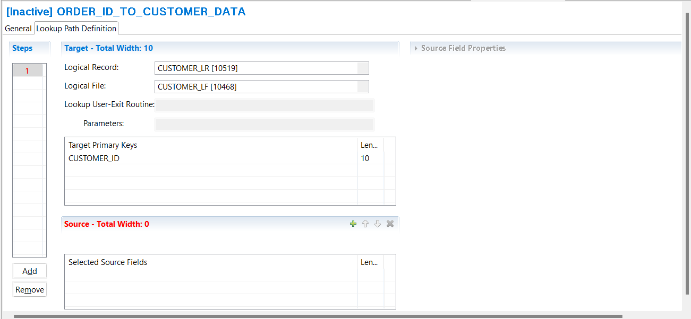
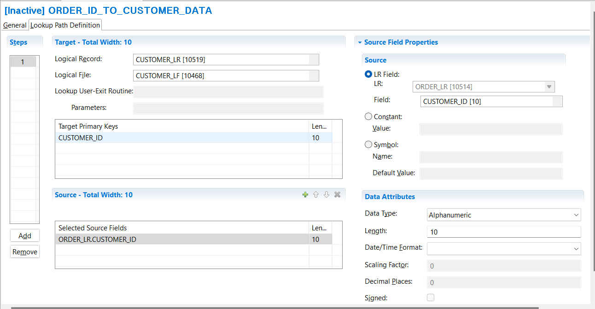
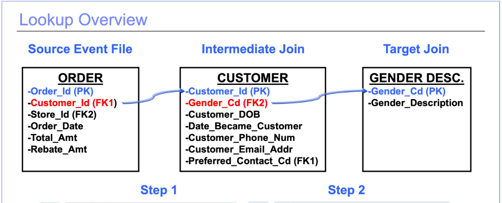

## Specifying Lookup Paths

A lookup path is a GenevaERS metadata component defining how to retrieve information from a target logical record (LR) using data from a source LR.

Lookup paths can be used by many different views. To view existing lookup paths, click Lookup Paths in the Navigator pane and open a lookup path in the metadata list at the bottom of the screen.

To create a new lookup path

1. Select **Administration** > **New** > **Lookup Path** from the menu.  
Lookup Path information is displayed across two tabs, **General** and **Lookup Path Definition**.  The General tab of the selected lookup path shows the lookup path ID, name, source LR, comments, and status, either active or inactive.  
2. In the **Name** field type a descriptive name.  
The name of the lookup path is visible when you are using it in views. When you name a lookup path, it is good practice to include the source-LR-to-target-LR mapping performed by the path.  
3. Select the source LR from the **Source Logical Record** drop down list. 
  

Next define the target of the Lookup Path:  
4. Select the **Lookup Path Definition** tab  
5. Select the target LR from the **Logical Record** drop down list.  
6. Select the target LF from the **Logical File** drop down list
The target LR must contain at least one field defined as a **Primary Key**. To read about LR definitions look at [Specifying LR, LF, and PF metatdata](../../AdvancedFeatures/MetaData/SpecifyLRLFPFs.md) in Advanced Features.  
  
    
You can then select the source fields that should be used to create a key to search the target to find a matching record. The accumulated length of the source fields must equal the total key length before the lookup path can be activated and used for processing in a view.

1. Click in the **Selected Source Fields** grid.
2. Select **Edit** > **Add Source Field**  
   or click on the **+** icon on the **Source** tool bar  
   The **Source Field Properties** area is displayed.
3. Select a source field from the source logical record, or specify a Constant Value or a Symbol Name that should be used in the key.  
Constants are static. A Symbol Name allows you to set the value in the view when the lookup path is used.  
When specifying a constant, carefully consider the format of the target key when setting the data attributes.  
4. You can build the key from multiple source fields or constants by selecting **Edit** > **Add Source Field** again.
5. Save the Lookup Path **File** > **Save**,  
   or click the Save icon in the Workbench toolbar,  
   or press **Ctrl + s**  
  

When you save a new lookup path, the lookup path ID is assigned by the Workbench and is not editable. It is used to make each lookup path unique and appears along with the lookup path name in views.

Lookup paths are created with an Inactive status and remain inactive until they are completely defined. They can then be activated, allowing for use in views.

If an active lookup path changes, all views referencing that lookup path are deactivated to prevent views from performing inaccurate joins. To deactivate a lookup, set the **Status** to **Inactive**; this also deactivates all the views using the lookup path.

### Multi-step Lookup Paths

Lookups can involve multiple files to access the data you require. The example shown here has two steps, with a lookup to the Customer file, followed by a lookup to the Gender Description file.

Lookup Path Definitions specify the full “path” or route from the source data to the final target data. The Lookup Path is made up of Lookup steps. Each step allows definition of a new target table. All fields from prior steps can be used as sources for key values with which to search these tables.

Create a multi-step Lookup Path
1. Create the first step of the Lookup Path as described in the **Lookup Path** section [above](#lookup-paths).  
It is good practise to name the Lookup Path so it describes the source and final target.
2. Select the **Lookup Path Definition** tab.
3. To add another step, click **Add** under the **Steps** section.  
You will see a number 2 appear in the Steps section, and have fresh **Target** and **Source** sections.
4. Select the target LR for step 2 from the **Logical Record** drop down list.  
6. Select the target LF for step 2 from the **Logical File** drop down list.
7. Click in the **Selected Source Fields** grid and add source fields as described previously.  
The source LRs avaiable are all LRs used in previous steps.
8. Add more steps if required, by clicking **Add** under the **Steps** section.
9. Save the Lookup Path **File** > **Save**,  
   or click the Save icon in the Workbench toolbar,  
   or press **Ctrl + s**.    

Care should be taken when building paths with respect to required data format conversions. GenevaERS joins use binary compares, meaning it matches byte for byte the key to a potential target record. Joins on numeric keys can fail if the source field formats do not match the target formats. GenevaERS will perform the necessary data conversations in the logic table when building keys to convert field formats if they are specified properly in the Look-up Path definition.
