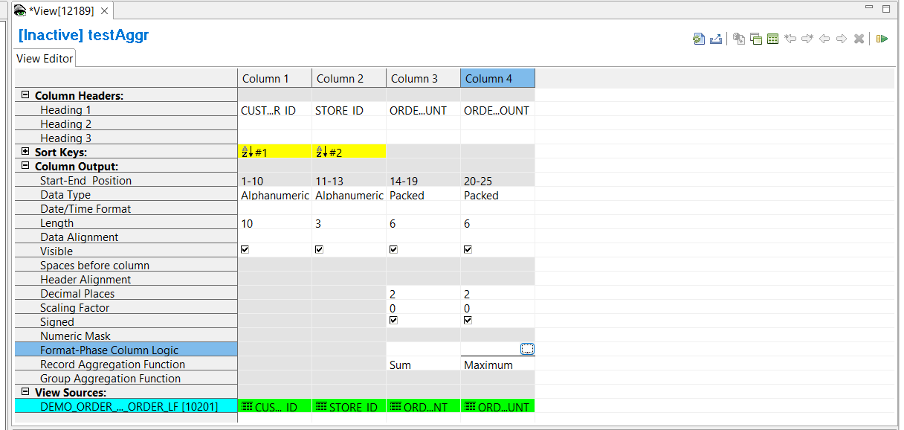

### Specify Format-Phase column logic

Format-Phase Column Logic can be applied to non-sort key numeric columns within summary views. 

To specify the logic text, double-click in the **Format-Phase Column Logic** cell for the column. 

This opens the **Format-Phase Column Logic** tab (**FCL** tab) in the Editor Area.  Opening the **FCL** tab also opens the **Logic Text Helper**, which enables you to place keywords and column numbers into logic for column assignment.  

Note that the cell will be grey, and can not be selected, if the column is data type Alphanumeric, the column is a sort key, or there is no format phase defined.

For more information see [Format-Phase Column Logic](../ColumnLogic.html#format-phase-column-logic) and [Format-Phase Column Logic reference](../../Reference/Workbench/LogicTextFCLStatements.html).