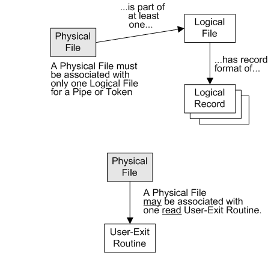
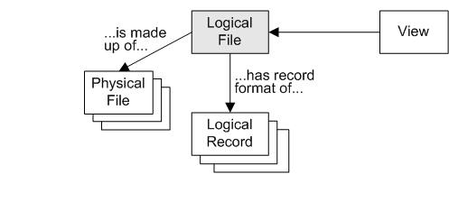

{: .no_toc}

# Input and Output 

TABLE OF CONTENTS 
1. TOC
{:toc}  

The GenevaERS Performance Engine reads source data using definitions in the GenevaERS Metadata Repository. Logical records, logical files and physical file definitions describe the inputs to the Performance Engine. View columns describe the output, and optionally logical file and physical file definitions can describe the output destination.

This page provides an overview of the GenevaERS metadata creation process for logical records and files, physical files, and methods for creating and then associating logical records, logical files, and physical files. 

A physical file definition describes a data source. Examples include customer files and order files.  
A logical file definition describes a collection of one or more physical files.  
A logical record definition, or LR, describes a record layout. In COBOL programs, record layouts are often found in copybooks. In relational databases, they are found in table definitions.

## Physical files

In GenevaERS the data source for a view can be a
- database
- disk file (sequential or VSAM)
- read user-exit - see topic "user-exits"
- pipe - see topic "Pipes overview",
- token - see topic "Tokens overview",
- tape file.

A physical file is not used directly in a view. Instead, a physical file is associated with at least one logical file. One physical file can be associated with many logical files, and one logical file can be associated with many physical files. The record format of the logical file (and any associated physical files) is given by one or more logical records. A view can use a logical file directly, but not a physical file.

If the physical file is a pipe or token, then the physical file can only be associated with one logical file, as indicated above.

Also, a physical file can be associated with one read user-exit routine.

The association between the physical file and one or more logical files is controlled by the logical file. A physical file is used in a view, when the view includes the logical file associated with the physical file. 

System administrators and environment administrators can always **create or modify physical files** and the other items above.

General users can **create or modify physical files** if the group for login has the relevant permissions. See [Workbench Security Overview](../AdvancedFeatures/SecurityOverview.md) and [Create Users, Groups and Permissions](./MetaData/CreateUsersGroupsPerm.md) for more information.

## Logical Files

A logical file is a collection of **physical files with the same record layout**.

For example, your company may have **sales files for all 50 states of the USA**. Each sales file is a physical file, and all share the **same record layout in a logical record**. Together all these sales files form one logical file which contains the entire USA sales data for your company.

Logical files are processed fast and efficiently, because all the associated  physical files can process in parallel. This is one of the many advantages of GenevaERS.

The mandatory requirement is that all physical files in the logical file share the same record layout. The record layout is called a logical record. **Every logical file has at least one logical record.**

System administrators and environment administrators can always **create or modify logical files**.

General users can **create or modify logical files** if the group for login has the relevant permissions. See [Workbench Security Overview](../AdvancedFeatures/SecurityOverview.md) and [Create Users, Groups and Permissions](./MetaData/CreateUsersGroupsPerm.md) for more information.

## Logical Records

A Logical Record can be one of two things:
- A record format for one or more logical files.
- The format of the columns in one or more views.

A logical record consists of fields that can be of the data types described in [Data Types.](./MetaData/DataTypes.md)

System administrators and environment administrators can always **create or modify logical records**.

General users can **create or modify logical files** if the group for login has the relevant permissions. See [Workbench Security Overview](../AdvancedFeatures/SecurityOverview.md) and [Create Users, Groups and Permissions](./MetaData/CreateUsersGroupsPerm.md) for more information.

## Creating metadata in the workbench

For information on defining all of the above in the workbench, see [Create LR, LF, PF metatdata.](./MetaData/CreateLRLFPFs.md)

See your **system** or **environment administrator** if you need more access to physical files, logical files or logical records in your environment, or more rights to create these items.