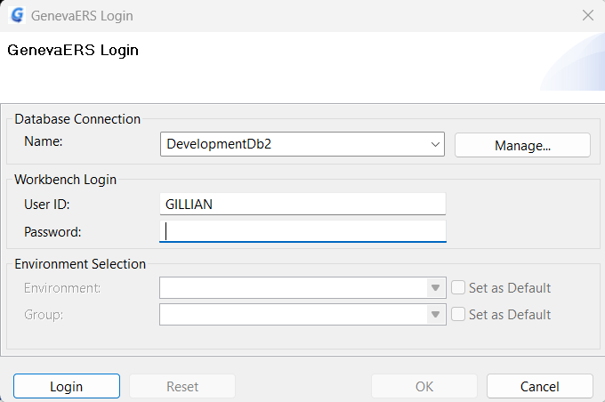
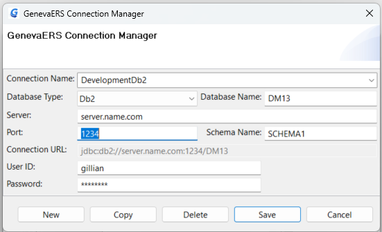

{: .no_toc}
# Connect to the Workbench 

TABLE OF CONTENTS 
1. TOC
{:toc}  

At least one database connection name must exist to allow login to the GenevaERS Workbench. A database connection name provides the access to a Database where the Workbench stores the metadata. 

Login and adding new database connections are described here.

## Login

1. Start the GenevaERS Workbench.
2. If this is your first login to the GenevaERS Workbench, the **GenevaERS Connection Manager** Screen will appear. See [Add new connection](#add-new-connection) below.
3. Otherwise the **GenevaERS login** screen will appear.
4. To select the database you want to connect to, select from the list **Database Connection** > **Name**.  
To add a new Database connection definition, click **Manage** and the **GenevaERS Connection Manager** Screen will appear. See [Add new connection](#add-new-connection) below.
5. Type **Workbench Login** > **User ID** with the User ID for the GenevaERS Workbench. If this is at least your second login, then the screen provides this value, which you can change if necessary. 
6. Enter **Workbench Login** > **Password**.  
Note: This User ID and password are likely different from the User ID for the Database. The User ID and password for the database are defined in the database connection.
7. Click **Login**

  

Once logged in to the database, the environment information is available.  
8. Select an **environment** (if there is a choice).  
If there is a list of environments, sort the list by clicking on "name" or "id" in the header of the list.  
9. Once an environment is selected you can set it as your default environment, by selecting **Set as Default**. This environment will display first for your next login. 
10. Select a **group** (if there is a choice).  
If there is a list of groups, sort the list by clicking on "name" or "id" in the header of the list. 
11. Once a group is selected and the environment above already has a tick for "Set as Default", then for this group you can click **Set as Default** to ensure this group displays first for your next login.  
If you are a system administrator, the groups field is grey
and no action is required in this field.
12. Click **OK**. Alternatively, click **Reset** to login to a different database, or as a different user name, and return to step 4.

## Add new connection

At the GenevaERS login screen
1. Select **Manage**
2. In the **Connection Name** field type a descriptive name.
3. Select the database type from **Database Type**. Currently the supported options are Db2 and PostgresQL.
4. In the **Database Name** field type the name of the Db2 database or Postgres database.
5. In the **Server** field type the IP address or domain name of the database host system.
6. In the **Port** field type the port number identifying the database.
7. In the **Schema Name** field type the name of the database schema where your GenevaERS metadata is going to reside.
8. In the **User ID** field type the User Id required to access the database. On mainframe systems, this is normally a RACF User Id.
9. In the **Password** field type the password for the User Id above.
10. Click **Save**