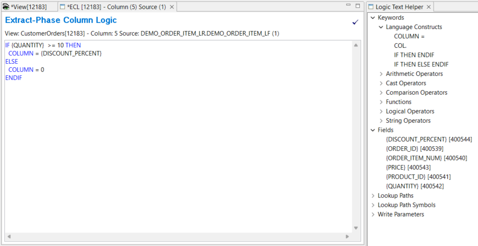
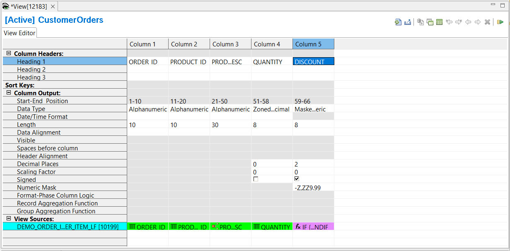

## Example 4: Adding column logic

GenevaERS provides column assignment logic and column calculations, which use GenevaERS logic text. Column logic is used to populate output columns with field values, constants, or calculations.

In this example you will add a column with some logic to the view created in Example 1 and modified in Examples 2 and 3. The column logic will display the discount, if the quantity is 10 or greater.

1. Open the **CustomerOrders** view by double-clicking the view listed in the Metadata List Area
2. Select **Column 4** by clicking on the column header.
3. Select **Edit** > **Insert Column After**  
or insert a new column using the buttons in View Editor toolbar.  
4. Click the green cell at the bottom of the new column.  
The Column Source Properties frame opens on the right.  
5.  From the **Column Source Type** list, select **Column Logic**
6.  To create and edit the column logic click in **Column Source Value**, then click in the icon on the right side .  
This opens the **Extract-Phase Column Logic** tab (**ECL** tab) in the Editor Area.  
  
Opening the **ECL** tab also opens the **Logic Text Helper**, which enables you to place keywords, field names, and column numbers into logic for column assignment. These functions are similar to functions provided by record filtering.

Add the following logic. 

      IF {QUANTITY}  >= 10 THEN
         COLUMN = {DISCOUNT_PERCENT}
      ELSE
         COLUMN = 0
      ENDIF

You can build up the logic by placing the curser in the **ECL** editor area, then double-clicking on the required text in the **Logic Text Helper**:  

1. **Keywords** > **Language Constructs** > IF THEN ELSE ENDIF  
2. **Fields** > {QUANTITY}  
3. **Keywords** > **Language Constructs** > COLUMN =  
4. **Fields** > {DISCOUNT_PERCENT}  

7. Save the Column Logic **File** > **Save**.
8. Close the **Extract-Phase Column Logic** tab.

### Column attributes

When using column logic you must consider the column attributes with regards to the fields or constants set in the logic text. In this example the column logic assigns DISCOUNT_PERCENT or 0 to the column. DISCOUNT_PERCENT has data type packed, length of 6-bytes , signed with 2 decimal places. You can specify that the data type is to be transformed in the column to Masked Numeric, with length of 8. 

Change the Data Type to Masked Numeric with Length 8:
1. Click on the **Data Type** cell for **Column 5**, and select **Masked Numeric** from the list.
2. Click on the **Length** cell for **Column 5**, and type **8** 
3. Click on the **Decimal Places** cell for **Column 5**, and type **2** 
4. Click the **Signed** cell for **Column 5** to indicate signed 
5. Optionally, you can add a **Column Header** to Column 5. Headers are used in the report output format, but in this case it is useful to add a header when the column output is defined by some logic. A header is not automatically displayed in the Workbench for a column with column logic.  
Click on the **Header 1** cell for **Column 5**, and type **DISCOUNT** 

<!-- Note that it is possible that transforming a packed 6 into a Masked Numeric of length 8 may result in overflow of large numbers. You must be aware of your data in cases like this. -->

6. Save the view **File** > **Save**.

### Activate the View 

To activate the view, use any of these methods: 
- Select  **Action** > **Activate** 
- Press the Activate icon on the View Editor toolbar 
- Press **F5**

The view title bar now displays the word "Active". Save the view again to preserve this active state. The view is now ready to be run.

For more information on column logic see [Extract-phase column logic](../../AdvancedFeatures/ColumnLogic.md) 

[Running the View](../RunView/RunView.md)

