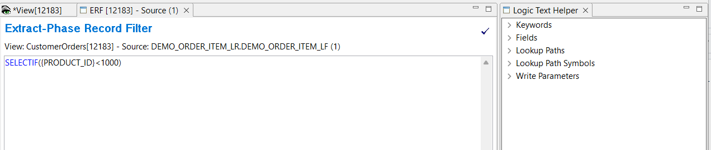
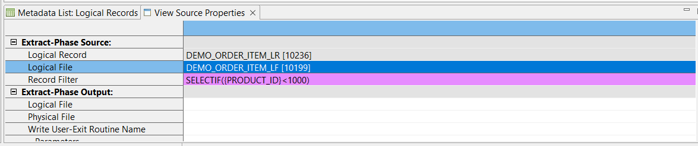

## Example 2: Add a filter

GenevaERS record filters use conditional processing to include or exclude records, based upon specific criteria. Extract-Phase record filtering is performed on the source records during the Extract Phase. There is also output record filtering which is performed in the format phase.

In this example you will add an Extract-Phase record filter to the view created in Example 1.

1. Open the **CustomerOrders** view by double-clicking the view listed in the Metadata List Area
2. Left click on the View Sources blue cell. This opens the **View Source Properties** tab in the Metadata List Area.
3. From the **Extract-Phase Source** > **Record Filter** double-click in the empty field  
This opens the **Extract-Phase Record Filter** area in the Editor Area, and the Logic Text Helper on the right side. The Logic Text Helper displays keywords and values that can be used in logic text.

4. You may wish to only report on products with a certain Product_ID range. Type the following in the Editor area  
**SELECTIF({PRODUCT_ID}<1000)**

5. Save the filter by pressing **Ctrl + s**
6. Close the **Extract-Phase Record Filter** tab
   
If you left click on the View Sources blue cell again to open the **View Source Properties** tab, you will see the record filter has been added.

Save the view **File** > **Save**,  
   or click the Save icon in the Workbench toolbar,  
   or press **Ctrl + s**

### Activate the View 

To activate the view, use any of these methods: 
- Select  **Action** > **Activate** 
- Press the Activate icon on the View Editor toolbar 
- Press **F5**

The view title bar now displays the word "Active". Save the view again to preserve this active state. The view is now ready to be run.

For more information on filters see [Record Filters](../../AdvancedFeatures/RecordFilters.md) in Advanced Features.

[Running the View](../RunView/RunView.md)
