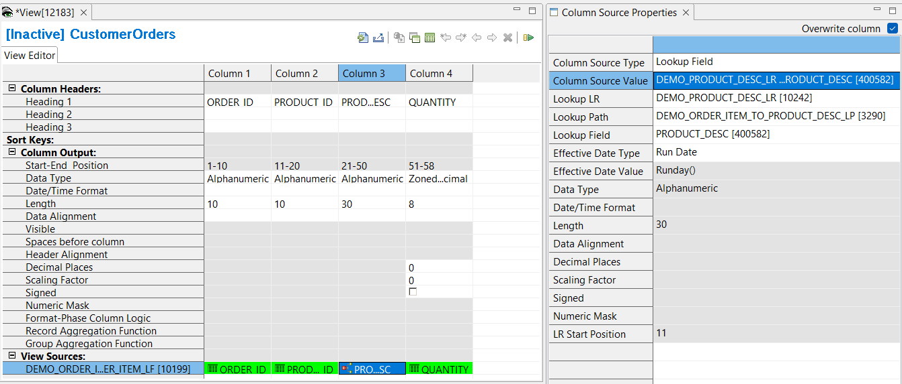

## Example 3: Adding a Lookup field 

GenevaERS allows users to combine or "join" data together from different files for selection tests or inclusion in an output. This requires telling GenevaERS which data from the two files to match, the source, and the target. These files typically have different layouts, described by differing GenevaERS logical records, or LRs. GenevaERS requires these source and target relationships to be predefined in a GenevaERS lookup path. The lookup path has a similar function to an SQL "where" clause in a relational database.

A lookup path is a GenevaERS metadata component defining how to retrieve information from a target logical record (LR) using data from a source LR.

In this example you will add a new column with a lookup field as the source to the view created in Example 1. You will use existing metadata from the Demo that defines the source LR, the target LR, and the Lookup path. 

For more information on how to define your own logical record, logical file and physical file definitions look at [Specifying LR, LF, and PF metatdata](../../AdvancedFeatures/MetaData/SpecifyLRLFPFs.md) in Advanced Features.

For more information on how to define your own lookup path definitions look at [Specifying Lookup Path metadata.](../../AdvancedFeatures/MetaData/SpecifyLookupPath.md) in Advanced Features.

1. Open the **CustomerOrders** view by double-clicking the view listed in the Metadata List Area
2. Select **Column 2** by clicking on the column header.
3. Select **Edit** > **Insert Column After**  
or insert a new column using the buttons in View Editor toolbar.
1. Click the green cell at the bottom of the new column.  
The Column Source Properties frame opens on the right.  
1.  From the **Column Source Type** list, select **Lookup Field**
2.  From the **Lookup LR** list, click the list box and select the target LR **DEMO_PRODUCT_DESC_LR**
3.  From the **Lookup Path** list, click the list box and select **DEMO_ORDER_ITEM_TO_PRODUCT_DESC_LP**
4.  From the **Lookup Field** list, click the list box and select **PRODUCT_DESC**

Save the view **File** > **Save**,  
   or click the Save icon in the Workbench toolbar,  
   or press **Ctrl + s**

### Activate the View 

To activate the view, use any of these methods: 
- Select  **Action** > **Activate** 
- Press the Activate icon on the View Editor toolbar 
- Press **F5**

The view title bar now displays the word "Active". Save the view again to preserve this active state. The view is now ready to be run.

[Running the View](../RunView/RunView.md)

[Reviewing the Reports]
