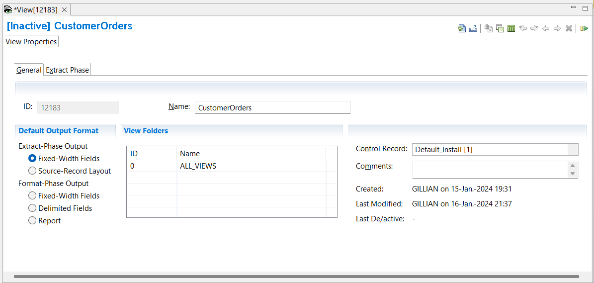
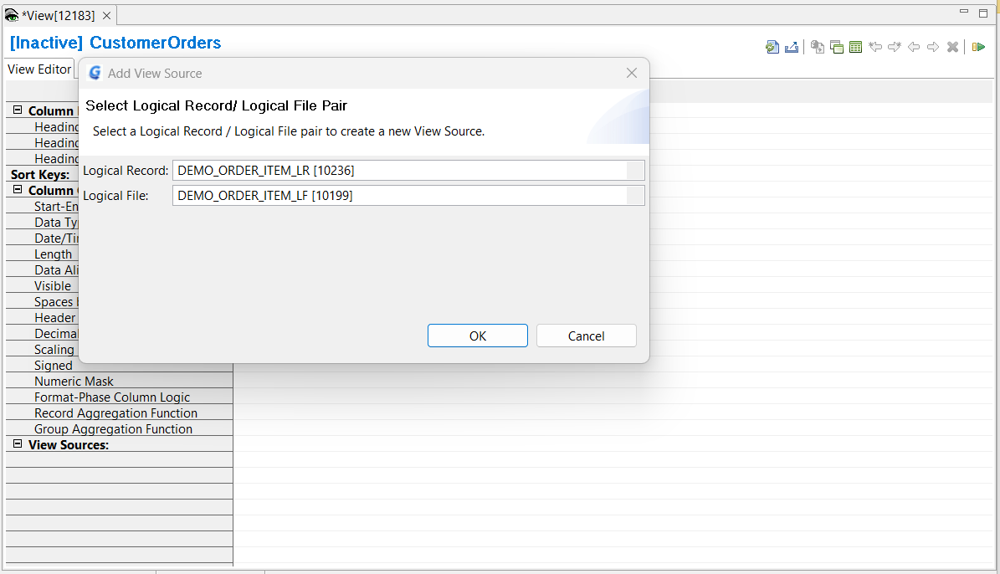
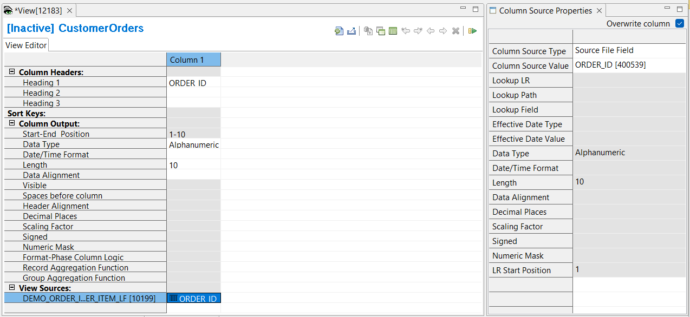
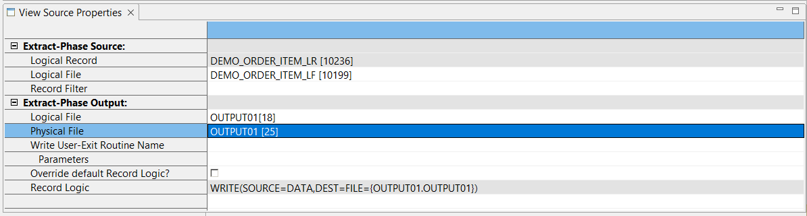

## Example 1: Creating a new View

In this example you will create a view that reads the order item files and performs a simple data transformation, writing out only the order ID, product ID and quantity. For this you need to define an Extract-Phase only view.

Select **Administration** > **New** > **View**

View information is displayed on two separate screens:

- The View Properties screen, where you can modify information that applies to the whole view.  
- The View Editor screen, where you can define specific data transformations.

The first screen presented is the View Properties screen

1. In the **Name** field type **CustomerOrders**
2. In the **Control Record** field select **Default_Install**
3. Click **Extract-Phase Output** with **Fixed-Width Fields** 
4. Save the view **File** > **Save**  

To toggle between the View Properties screen and the View Editor screen,  
- press **F9**,  
- or click the **Show Grid / Properties** button in the Editor area toolbar.

### View Source 

Next you are going to specify the input to the view, the view source, by selecting a logical file and logical record. You will use metadata already defined as part of the Demo.

6. Change to the View Editor screen
7. Select **Edit** > **Add View Source**  
   Alternatively, you can Right Click on **View Sources** then select **Add View Source**
8. In the pop-up window use the drop down arrow to select:
   - Logical Record: **DEMO_ORDER_ITEM_LR**
   - Logical File: **DEMO_ORDER_ITEM_LR**
   - Click **OK**

For more information on how to define your own logical record, logical file and physical file definitions look at [Create LR, LF, and PF metatdata](../../AdvancedFeatures/MetaData/CreateLRLFPFs.md) in Advanced Features.

### Adding Columns

Next define the output layout. The output layout is definied by adding columns to the view. The columns contain the characteristics of the output such as data type, the length, and the alignment, such as left, right, or center. They can also contain logic and lookup fields, which will be described later.

1. Select **Edit** > **Insert Column After**  
or you can insert a new column using the View Editor toolbar in the top right of the Editor Area. The arrow icons are used to insert new columns, or to move columns.  
A new column is added to the grid.
2.  Click the green cell at the bottom of the new column.  
The Column Source Properties frame opens on the right.  
3.  From the **Column Source Type** list, select **Source File Field**
4.  From the **Column Source Value** list, click the list box and select **ORDER_ID**

Repeat the previous steps to add columns for **PRODUCT_ID** and **QUANTITY**. 

### Changing column attributes

Data can be transformed into numerous different types, many of which are not available as standard formats in COBOL or other languages. The choice of this attribute affects other column attributes, such as length, sign, decimal place, and mask, and thus is very important in building file output views.

**QUANTITY** has data type of Binary with length 2. 

Change the Data Type to Zoned Decimal with Length 8:
1. Click on the Data Type cell for **QUANTITY**, and select **Zoned Decimal** from the list.
2. Click on the Length cell for **QUANTITY**, and type **8** 

For more information on Data Types look [here](../../AdvancedFeatures/MetaData/DataTypes.md)

### Adding Output destination

The default output destination for Extract-Phase only Views is the DD **F*****nnnnnnn*** where ***nnnnnnn*** is the view ID. For example, if the view ID is **12183** the default DD name for Extract-Phase only Views is **F0012183**.

You can specify your own output destination. To do this:

1. Left click on the View Sources blue cell you added earlier. This opens the **View Source Properties** tab in the Metadata List Area.
2. From the **Extract-Phase Output** > **Logical File** list select **OUTPUT01**
3. From the **Extract-Phase Output** > **Physical File** list select **OUTPUT01**
4. Save the view **File** > **Save**

You will see that the WRITE statement in the **Read Logic** field has changed.

For more information on how to define your own logical file and physical file definitions look at [Create LR, LF, and PF metatdata](../../AdvancedFeatures/MetaData/CreateLRLFPFs.md) in Advanced Features.

### Activate the View 

To activate the view, use any of these methods: 
- Select  **Action** > **Activate** 
- Press the Activate icon on the View Editor toolbar 
- Press **F5**

The view title bar now displays the word "Active". Save the view again to preserve this active state. The view is now ready to be run.

[Running the View](../RunView/RunView.md)

[Reviewing the Reports]
