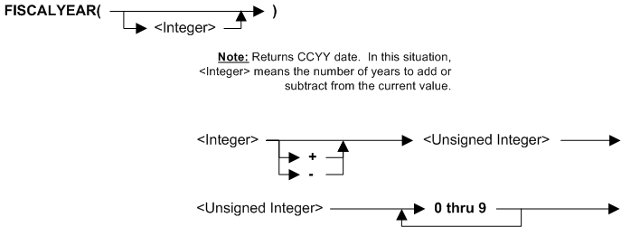

---
layout: default
title: "Function FISCALYEAR"
parent: Functions
grand_parent: Workbench Logic Text Full Details
nav_order: 9
---
# Function FISCALYEAR
{: .no_toc}
TABLE OF CONTENTS 
1. TOC
{:toc}  

# How do I use FISCALYEAR? 

FISCALYEAR returns a year based on the Fiscal Parameters in the control record for the environment for a view. This means that different views running in the same batch can have different Fiscal dates because they come from different environments. By comparison, RUNDAY is the same for all views in a batch.

The VDP can override the fiscal values in the control record - see the next section below.

The FISCALYEAR returns a date in CCYY format that is appropriate for the environment of that view.

The parameter for FISCALYEAR is a number of years to add or delete from the default FISCALYEAR. For example, FISCALYEAR\(-5\) provides the year that is five years before the date the view is run.

FISCALYEAR can only be used in **Extract Record Filter** or **Extract Column Assignment** logic text.

# VDP for view can override fiscal values in a control record

A view specifies a control record, and so the values in the control record normally apply to that view.

The VDP for a view can override the fiscal values in a control record. In those cases the view ignores the fiscal values in the control record and uses the VDP fiscal values.

For more, see the \[FISCAL DATES\] section in the configuration file for MR91 in as given in topic [Runbook - MR91 Control File Generator](../../PE Programs/Runbook - MR91 Control File Generator). 

# Syntax 

# Rules for the syntax 

FISCALYEAR can only be used in **Extract Record Filter** or **Extract Column Assignment** logic text.

See also topic: [Rules for all Logic Text](../Rules for all Logic Text) 

# Examples: FISCALYEAR function in Extract Record Filter 

|Example logic text|Meaning|
|------------------|-------|
|**IF ({field4} = FISCALYEAR(-1)) &nbsp;&nbsp;&nbsp;&nbsp;THEN SELECT ENDIF**|Select any input records where field4 is the previous fiscal year and skip all other records. The example at left assumes that field4 is a fiscal year number. The code at left can also be written as: &nbsp;&nbsp;&nbsp;&nbsp;**SELECTIF({field4} >= FISCALYEAR(-1))**|

# Examples: FISCALYEAR function in Extract Column Assignment 

|Example logic text|Meaning|
|------------------|-------|
|**COLUMN = FISCALYEAR()**|Set the current column to the current fiscal year number.|

  

  
  (Examples can be copied to the clipboard.)
  

