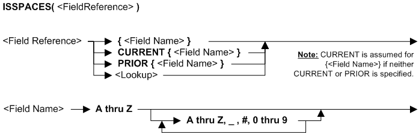
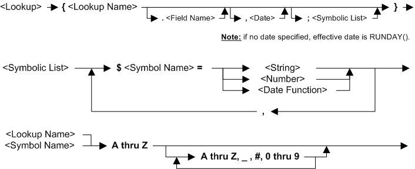

---
layout: default
title: "Function ISSPACES"
parent: Functions
grand_parent: Workbench Logic Text Full Details
nav_order: 17
---
# Function ISSPACES
{: .no_toc}
TABLE OF CONTENTS 
1. TOC
{:toc}  

# How do I use ISSPACES? 

If you provide an input field or lookup path then ISSPACES returns true if the input field or lookup path field contains spaces, and false if the value is anything else.

ISSPACES can only be used in **Extract Record Filter** or **Extract Column Assignment** logic text.

# Syntax 

# Rules for the syntax 

ISSPACES can only be used in **Extract Record Filter** or **Extract Column Assignment** logic text.

If this functions checks a lookup, and **no effective date** is specified, the lookup uses RUNDAY\( \) - see topic: [Syntax - function RUNDAY](Syntax - function RUNDAY)

See also topic: [Rules for all Logic Text](../Rules for all Logic Text) 

# Examples: ISSPACES function in Extract Record Filter 

|Example logic text|Meaning|
|------------------|-------|
|**IF ISSPACES({field9}) &nbsp;&nbsp;&nbsp;&nbsp;THEN SKIP ENDIF**|Skip all input records where field9 is spaces, and select all other records. This example is the same as: &nbsp;&nbsp;&nbsp;&nbsp;**SKIPIF(ISSPACES({field9})**|

# Examples: ISSPACES function in Extract Column Assignment 

|Example logic text|Meaning|
|------------------|-------|
|**IF ISSPACES({field1}) &nbsp;&nbsp;&nbsp;&nbsp;THEN COLUMN = "DEFAULT" &nbsp;&nbsp;&nbsp;&nbsp;ELSE COLUMN = {field1} ENDIF**|If field1 for the current record is spaces, then set the current column to "DEFAULT", otherwise set the current column to field1.|

  
  (Examples can be copied to the clipboard.)
  

