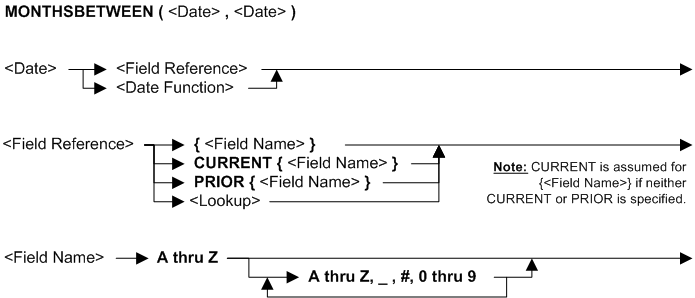

---
layout: default
title: "Function MONTHSBETWEEN"
parent: Functions
grand_parent: Workbench Logic Text Full Details
nav_order: 18
---
# Function MONTHSBETWEEN
{: .no_toc}
TABLE OF CONTENTS 
1. TOC
{:toc}  

# How do I use MONTHSBETWEEN? 

Use MONTHSBETWEEN to compare dates and return the difference in months.

MONTHSBETWEEN can only be used in **Extract Record Filter (ERF)** and **Extract Column Assignment (ECA)** logic text.

# Syntax 

# Rules for the syntax 

MONTHSBETWEEN can only be used in **Extract Record Filter (ERF)** and **Extract Column Assignment(ECA)** logic text.

See also topic: [Rules for all Logic Text](../Rules for all Logic Text) 

# Examples: MONTHSBETWEEN function in ERF 

|Example logic text|Meaning|
|------------------|-------|
|**IF (MONTHSBETWEEN({field1},{field2}) >= 3) &nbsp;&nbsp;&nbsp;&nbsp;THEN SELECT ENDIF**|Select only records where there are at least 3 months between field1 and field2, and skip all other records. This example is the same as: &nbsp;&nbsp;&nbsp;&nbsp;**SELECTIF(MONTHSBETWEEN({field1},{field2}) >= 3)**|

# Examples: MONTHSBETWEEN function in ECA 

|Example logic text|Meaning|
|------------------|-------|
|**COLUMN = MONTHSBETWEEN({BUY_DATE},{SHIP_DATE})**|Set the current column to the months between the transaction date and the shipping date.|
|**IF (MONTHSBETWEEN({BUY_DATE},{SHIP_DATE}) > 1) &nbsp;&nbsp;&nbsp;&nbsp;THEN COLUMN = {SHIP_DATE} &nbsp;&nbsp;&nbsp;&nbsp;ELSE COLUMN = {BUY_DATE} ENDIF**|If there is more than one month between the transaction date and the shipping date, then set the current column to the shipping date, otherwise set the current column to the transaction date.|
|**IF (MONTHSBETWEEN({BUY_DATE},{SHIP_DATE})> 6) &nbsp;&nbsp;&nbsp;&nbsp;THEN WRITE(SOURCE=VIEW,DEST=EXT=03) ENDIF**|Write to extract 3 those records where there are more than 6 months between the transaction date and the shipping date.|

  
  (Examples can be copied to the clipboard.)
  

