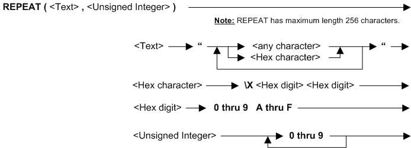

---
layout: default
title: "Function REPEAT"
parent: Functions
grand_parent: Workbench Logic Text Full Details
nav_order: 21
---
# Function REPEAT
{: .no_toc}
TABLE OF CONTENTS 
1. TOC
{:toc}  

# How do I use REPEAT? 

If you provide a text string and an integer, then REPEAT can create a string that consists of the given text string with integer repetitions. REPEAT is different from ALL because REPEAT has a fixed number of repetitions, whereas ALL is flexible and compares with fields of different lengths.

REPEAT can only be used in **Extract Record Filter (ERF)** and **Extract Column Assignment (ECA)** logic text.

# Syntax 

# Rules for the syntax 

REPEAT has a maximum length of 256 characters.

REPEAT can only be used in **Extract Record Filter (ERF)** and **Extract Column Assignment(ECA)** logic text.

See also topic: [Rules for all Logic Text](../Rules for all Logic Text) 

# Examples: REPEAT function in ERF 

|Example logic text|Meaning|
|------------------|-------|
|**IF NOT ({field7} = REPEAT("-", 13)) &nbsp;&nbsp;&nbsp;&nbsp;THEN SELECT ENDIF**|Select for output those records with field7 is not equal to 13 dashes. This example is the same as: &nbsp;&nbsp;&nbsp;&nbsp;**SKIPIF({field7} = REPEAT("-", 13))**|
|**IF ({field8} = REPEAT("-", 13)) &nbsp;&nbsp;&nbsp;&nbsp;THEN SKIP ENDIF**|Skip for output those records with field8 is equal to 13 dashes. Select all other records. This example is the same as: &nbsp;&nbsp;&nbsp;&nbsp;**SKIPIF({field8} = REPEAT("-", 13))**|

# Examples: REPEAT function in ECA 

|Example logic text|Meaning|
|------------------|-------|
|**IF ({field9} = "Total") &nbsp;&nbsp;&nbsp;&nbsp;THEN COLUMN = REPEAT("-", 13) ENDIF**|If field9 is "Total" then set the current column to 13 dashes.|
|**IF ({field10} = REPEAT("-", 13)) &nbsp;&nbsp;&nbsp;&nbsp;THEN COLUMN = {field1} + {field2} ENDIF**|If field10 is 13 dashes, then set the current column to a total of fields 1 and 2.|

  
  (Examples can be copied to the clipboard.)
  

