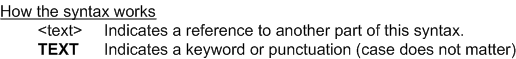

---
layout: default
title: "Function RUNQUARTER"
parent: Functions
grand_parent: Workbench Logic Text Full Details
nav_order: 25
---
# Function RUNQUARTER
{: .no_toc}
TABLE OF CONTENTS 
1. TOC
{:toc}  

# What is RUNQUARTER?

Normally, the date PE runs is the "run date".

The run date can be set to a fixed value in the VDP. See the next section for details of possible values.

RUNQUARTER returns a CCYYMM format date \(at the start of a quarter\) based on the run date. All views in a batch use the same base date for RUNQUARTER.

# Possible values of the VDP run date

The date that PE runs is the VDP run date unless there is a specific value set in the VDP.  To set a specific value in the VDP see the RUNDATE parameter for the configuration file to MR91 as given in topic [Runbook - MR91 Control File Generator](../../PE Programs/Runbook - MR91 Control File Generator). 

# How do I use RUNQUARTER? 

The parameter for RUNQUARTER is a number of quarters to add or delete from the default RUNQUARTER. For example, RUNQUARTER\(-5\) provides the day five quarters before the date the view is run.

RUNQUARTER can only be used in **Extract Record Filter** or **Extract Column Assignment** logic text.

# Syntax 

# Rules for the syntax 

RUNQUARTER can only be used in **Extract Record Filter** or **Extract Column Assignment** logic text.

See also topic: [Rules for all Logic Text](../Rules for all Logic Text) 

# Examples: RUNQUARTER function in Extract Record Filter 

|Example logic text|Meaning|
|------------------|-------|
|**IF ({field3} >= RUNQUARTER(-1)) &nbsp;&nbsp;&nbsp;&nbsp;THEN SELECT ENDIF**|Select any input records where field3 is the previous quarter or later, and skip all other records. The example at left assumes that field3 is a month value. The code at left can also be written as: &nbsp;&nbsp;&nbsp;&nbsp;**SELECTIF({field3} >= RUNQUARTER(-1))**|

# Examples: RUNQUARTER function in Extract Column Assignment 

|Example logic text|Meaning|
|------------------|-------|
|**COLUMN = RUNQUARTER()**|Set current column to the start of the current quarter in CCYYMM format.|

  
  (Examples can be copied to the clipboard.)
  

