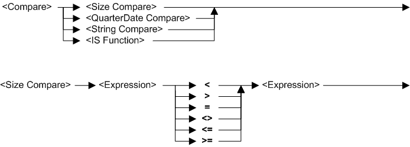
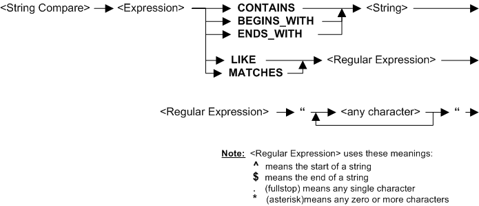
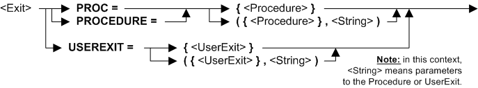

---
layout: default
title: "IF statements (ECA)"
nav_order: 2
parent: IF statements
grand_parent: Workbench Logic Text Full Details
---
# IF statements (ECA)
{: .no_toc}
TABLE OF CONTENTS 
1. TOC
{:toc}  
 

# How do I use IF statements in ECA? 

IF statements can be part of any logic text. An IF statement allows a condition to control if one or more statements are executed.

Even though IF statements are allowed in all logic text, the statements that can be called in an IF statement change depending on the particular logic text.

An IF statement can call another IF statement - this is called "nesting" of IF statements, and is allowed in all logic text.

The syntax details of an IF statement in Extract Column Assignment are shown below.

# Syntax 

# Rules for the syntax 

See also topic: [Rules for all Logic Text](../Rules for all Logic Text) 

# Examples: IF with COLUMN & COL.nnn (ECA)

In all the following examples, **COLUMN can be replaced by COL.nnn**, for example COL.3. You can set the value of any COL.nnn from any other column. You can create multiple IF statements in Extract Column Assignment logic text. However, you cannot inquire on COL.nnn \(for example, IF COL.4 = 0 is not allowed\).

|Example logic text|Meaning|
|------------------|-------|
|**IF ({field1} > 0) THEN &nbsp;&nbsp;&nbsp;&nbsp;COLUMN = ({field2}/{field1}) \* 100 &nbsp;&nbsp;&nbsp;&nbsp;COL.27 = {field1} \* {field26} &nbsp;&nbsp;&nbsp;&nbsp;COL.28 = {field14} + {field1} ELSE &nbsp;&nbsp;&nbsp;&nbsp;COLUMN = 0 &nbsp;&nbsp;&nbsp;&nbsp;COL.27 = 0 &nbsp;&nbsp;&nbsp;&nbsp;COL.28 = 0 ENDIF**|If field1 is greater than zero then set current column to field2 divided by field1 all multiplied by 100, set column 27 to field1 times field26 and set column 28 to field 14 plus field1. If field1 is not greater than zero then set current column and columns 27 and 28 to zero.|
|**IF (CURRENT({field5}) <> PRIOR({field5})) &nbsp;&nbsp;&nbsp;&nbsp;THEN COLUMN = "PRODUCT: " &nbsp;&nbsp;&nbsp;&nbsp;ELSE COLUMN = " " ENDIF**|If current record field5 has a different value from the previous record,  set current column to "PRODUCT: " otherwise set current column to blank. This assumes the input file is sorted into field5 order.|
|**IF ({field5} = "Total") &nbsp;&nbsp;&nbsp;&nbsp;THEN COLUMN = ALL("-") ENDIF**|If field5 is "Total" then set current column to all dashes.|
|**IF {field6} = ALL("-") &nbsp;&nbsp;&nbsp;&nbsp;THEN COLUMN = {field2} + {field3} ENDIF**|If field6 is all dashes, then set current column to a total of fields 2 and 3.|
|**IF ({field5} = "Total") &nbsp;&nbsp;&nbsp;&nbsp;THEN COLUMN = REPEAT("-", 13) ENDIF**|If field5 is "Total" then set current column to 13 dashes.|
|**IF ({field6} = REPEAT("-", 13)) &nbsp;&nbsp;&nbsp;&nbsp;THEN COLUMN = {field2} + {field3} ENDIF**|If field6 is 13 dashes, then set current column to a total of fields 2 and 3.|
|**IF ({field5} = "Total") &nbsp;&nbsp;&nbsp;&nbsp;THEN COLUMN = "\xFF" ENDIF**|If field5 is "Total" then set current column to hexadecimal FF.|
|**IF ({field6} = "\xFF") &nbsp;&nbsp;&nbsp;&nbsp;THEN COLUMN = {field2} + {field3} ENDIF**|If field6 is hexadecimal FF, then set current column  to a total of fields 2 and 3.|
|**IF ISNOTSPACES({field1}) &nbsp;&nbsp;&nbsp;&nbsp;THEN COLUMN = {field1} &nbsp;&nbsp;&nbsp;&nbsp;ELSE COLUMN = "DEFAULT" ENDIF**|If field1 is not spaces then set current column to field1, otherwise set current column to "DEFAULT".|
|**IF ISFOUND({Lookup1}) &nbsp;&nbsp;&nbsp;&nbsp;THEN COLUMN = {Lookup1} &nbsp;&nbsp;&nbsp;&nbsp;ELSE COLUMN = " " ENDIF**|If the lookup path Lookup1 uses current record to successfully find a target record, then set current column to lookup path field found, otherwise set current column to blank.|
|**IF ISFOUND({Lookup2;$SYM="A"}) &nbsp;&nbsp;&nbsp;&nbsp;THEN COLUMN = {Lookup2;$SYM="A"} &nbsp;&nbsp;&nbsp;&nbsp;ELSE COLUMN = 0 ENDIF**|If lookup path Lookup2 with symbol SYM "A" works, then set current column to that lookup field,  otherwise set current column to zero.|
|**IF ISNULL({field4} &nbsp;&nbsp;&nbsp;&nbsp;THEN COLUMN = "EMPTY" &nbsp;&nbsp;&nbsp;&nbsp;ELSE COLUMN = {field4} ENDIF**|If field4 for current record has null values, then set current column to "EMPTY", otherwise set current column to field4.|
|**IF ISNUMERIC({field4} &nbsp;&nbsp;&nbsp;&nbsp;THEN COLUMN = {field4} \* 100 &nbsp;&nbsp;&nbsp;&nbsp;ELSE COLUMN = 0 ENDIF**|If field4 for current record is numeric, then set current column to field4 times 100, otherwise set current column to zero.|
|**IF (DAYSBETWEEN({BUY_DATE},{SHIP_DATE}) &nbsp;&nbsp;&nbsp;&nbsp;> 10) &nbsp;&nbsp;&nbsp;&nbsp;THEN COLUMN = {SHIP_DATE} &nbsp;&nbsp;&nbsp;&nbsp;ELSE COLUMN = {BUY_DATE} ENDIF**|If there are more than 10 days between the  transaction date and the shipping date, then set current column to the shipping date, otherwise set current column to the transaction date.|
|**IF ({field1} BEGINS_WITH "BBB") &nbsp;&nbsp;&nbsp;&nbsp;THEN COLUMN = {field1} &nbsp;&nbsp;&nbsp;&nbsp;ELSE COLUMN = " " ENDIF**|If field1 begins with characters "BBB" then set current column to field1, otherwise set current column to blank.|
|**IF ({field2} CONTAINS "CCC") &nbsp;&nbsp;&nbsp;&nbsp;THEN COLUMN = {field2} &nbsp;&nbsp;&nbsp;&nbsp;ELSE COLUMN = " " ENDIF**|If field2 contains characters "CCC" then set current column to field2, otherwise set current column to blank.|
|**IF ({field3} ENDS_WITH "EEE") &nbsp;&nbsp;&nbsp;&nbsp;THEN COLUMN = {field3} &nbsp;&nbsp;&nbsp;&nbsp;ELSE COLUMN = " " ENDIF**|If field3 ends with characters "EEE" then set current column to field3, otherwise set current column to blank.|
|**IF ({field4} MATCHES "...") &nbsp;&nbsp;&nbsp;&nbsp;THEN COLUMN = {field4} &nbsp;&nbsp;&nbsp;&nbsp;ELSE COLUMN = " " ENDIF**|If field4 has three characters then set current column to field4, otherwise set current column to blank.|
|**IF ({field1} LIKE "MA...") &nbsp;&nbsp;&nbsp;&nbsp;THEN COLUMN = {field1} &nbsp;&nbsp;&nbsp;&nbsp;ELSE COLUMN = " " ENDIF**|For input records with field1 exactly 5 characters starting with "MA", then set current column to field1 otherwise set current column to one blank.|
|**IF ({field1} LIKE "..VA..") &nbsp;&nbsp;&nbsp;&nbsp;THEN COLUMN = {field1} &nbsp;&nbsp;&nbsp;&nbsp;ELSE COLUMN = " " ENDIF**|For input records with field1 exactly 6 characters with characters 3 and 4 as "VA", then set current column to field1 otherwise set current column to one blank.|
|**IF ({field1} LIKE ".....NA") &nbsp;&nbsp;&nbsp;&nbsp;THEN COLUMN = {field1} &nbsp;&nbsp;&nbsp;&nbsp;ELSE COLUMN = " " ENDIF**|For input records with field1 exactly 6 characters ending in "NA", then set current column to field1 otherwise set current column to one blank.|
|**IF ({field1} LIKE "^BBB\*") &nbsp;&nbsp;&nbsp;&nbsp;THEN COLUMN = {field1} &nbsp;&nbsp;&nbsp;&nbsp;ELSE COLUMN = " " ENDIF**|If field1 begins with characters "BBB" then set current column to field1, otherwise set current column to one blank.|
|**IF ({field1} LIKE "*CCC*") &nbsp;&nbsp;&nbsp;&nbsp;THEN COLUMN = {field1} &nbsp;&nbsp;&nbsp;&nbsp;ELSE COLUMN = " " ENDIF**|If field1 contains characters "CCC" then set current column to field1, otherwise set current column to one blank.|
|**IF ({field1} LIKE "\*EEE$") &nbsp;&nbsp;&nbsp;&nbsp;THEN COLUMN = {field1} &nbsp;&nbsp;&nbsp;&nbsp;ELSE COLUMN = " " ENDIF**|If field1 ends with characters "EEE" then set current column to field1, otherwise set current column to one blank.|
|**IF ({field1} LIKE "^B\*C\*E$") &nbsp;&nbsp;&nbsp;&nbsp;THEN COLUMN = {field1} &nbsp;&nbsp;&nbsp;&nbsp;ELSE COLUMN = " " ENDIF**|If field1 begins "B", contains "C" and ends "E" then set current column to field1, otherwise set current column to one blank.|

# Examples: IF with WRITE (ECA)

|Example logic text|Meaning|
|------------------|-------|
|**IF (ISNUMERIC({field4}) AND &nbsp;&nbsp;&nbsp;&nbsp;({field5} > {field6} \* 10) AND &nbsp;&nbsp;&nbsp;&nbsp;(ISNOTSPACES{field7} &nbsp;&nbsp;&nbsp;&nbsp;THEN WRITE (SOURCE=DATA, &nbsp;&nbsp;&nbsp;&nbsp;&nbsp;&nbsp;&nbsp;&nbsp; USEREXIT={DB2_Update}) ENDIF**|If field4 is numeric and field5 is greater than field6 times 10 and field7 is not spaces, then call the user-exit routine DB2\_Update for the columns up to the current point. This effectively writes to a DB2 table the columns in that record up to the current point.|
|**IF (ISNOTNULL({field3}) AND &nbsp;&nbsp;&nbsp;&nbsp;&nbsp;&nbsp;({field2} = {field1} + {field5} &nbsp;&nbsp;&nbsp;&nbsp;THEN WRITE (SOURCE=INPUT, &nbsp;&nbsp;&nbsp;&nbsp;&nbsp;&nbsp;&nbsp;&nbsp; DEST=FILE={LogicalFile3}) ENDIF**|If field3 is not nulls and field2 equals field1 plus field 5 then write the entire input record to LogicalFile3. All columns in the input record are included, no matter what column contains this logic text.|
|**IF (DAYSBETWEEN({field12},{field15}) &nbsp;&nbsp;&nbsp;&nbsp;&nbsp;&nbsp;> 10) AND &nbsp;&nbsp;&nbsp;&nbsp;(ISFOUND({Lookup3;$SYM="A"})) &nbsp;&nbsp;&nbsp;&nbsp;THEN WRITE (SOURCE=VIEW, &nbsp;&nbsp;&nbsp;&nbsp;&nbsp;&nbsp;&nbsp;&nbsp;DEST=EXT=03) ENDIF**|If field12 and field15 are more than 10 days apart and the lookup path Lookup3 works with symbol SYM set to "A", then write the columns up to the current point to extract work file \(EXT\) 3. This assumes that the control record for this environment has a Maximum Extract File Number that is at least 3,  or any overwrite of the VDP has also set this parameter to at least 3|

  
  (Examples can be copied to the clipboard.)
  

