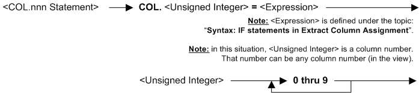

---
layout: default
title: "Syntax - COLUMN & COL.nnn statements (ECA)"
parent: Syntax - Extract Column Assignment (ECA)
grand_parent: Workbench Logic Text Syntax Diagrams
nav_order: 2
---

# Syntax - COLUMN & COL.nnn statements (ECA)
{: .no_toc}
TABLE OF CONTENTS 
1. TOC
{:toc}  
 
 # COLUMN & COl.nnn (ECA)
 

