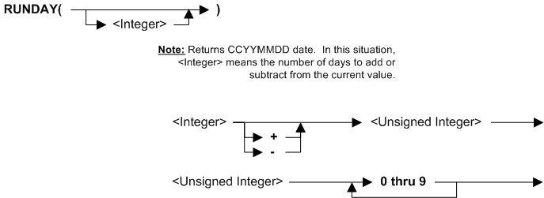

---
layout: default
title: "Syntax - Functions (ECA)"
parent: Syntax - Extract Column Assignment (ECA)
grand_parent: Workbench Logic Text Syntax Diagrams
nav_order: 3
---

# Syntax - Functions (ECA)
{: .no_toc}
TABLE OF CONTENTS 
1. TOC
{:toc}  
 

# Functdion ALL

# Functdion BATCHDATE

# Functdion DATE

# Functdion DAYSBETWEEN

# Functdion FISCALDAY

# Functdion FISCALMONTH

# Functdion FISCALQUARTER

# Functdion FISCALYEAR

# Functdion ISFOUND

# Functdion ISNOTFOUND

# Functdion ISNOTNULL

# Functdion ISNOTNUMERIC

# Functdion ISNOTSPACES

# Functdion ISNULL

# Functdion ISNUMERIC

# Functdion ISSPACES

# Funcdtion MONTHSBETWEEN

# Funcdtion PRIOR

# Funcdtion Q1, Q2, Q3 and Q4 

# Funcdtion REPEAT

# Funcdtion RUNDAY

# Funcdtion RUNMONTH

# Funcdtion RUNPERIOD

# Funcdtion RUNQUARTER

# Funcdtion RUNYEAR

# Funcdtion YEARSBETWEEN

